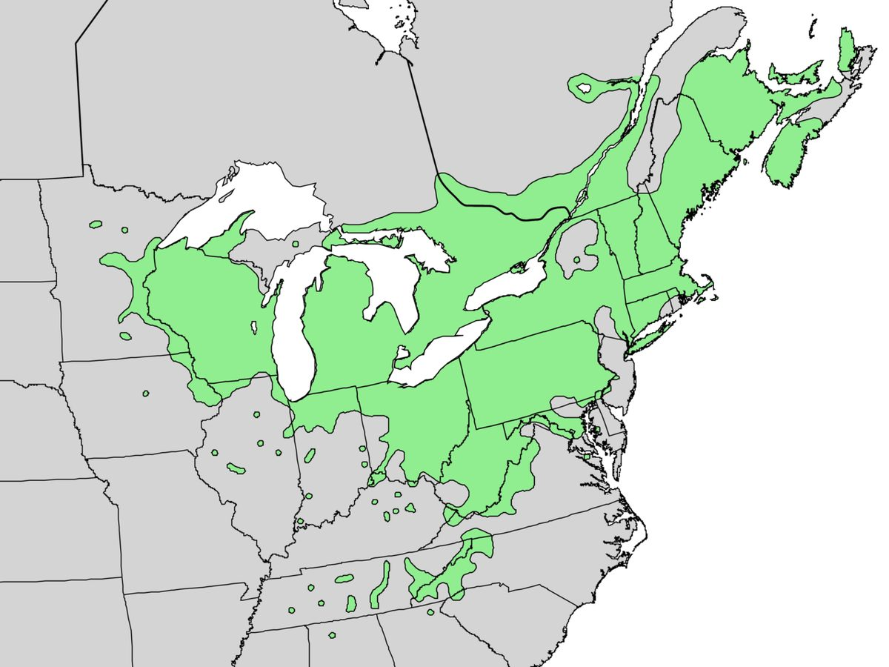

# Staghorn Sumac

*Rhus typhina*

Rhus typhina, the staghorn sumac, is a species of flowering plant in the family Anacardiaceae, native to eastern North America. It is primarily found in southeastern Canada, the northeastern and midwestern United States, and the Appalachian Mountains, but it is widely cultivated as an ornamental throughout the temperate world. It is an invasive species in some parts of the world.

## Quick Facts

| | |
|---|---|
| **Scientific name** | *Rhus typhina* |
| **Family** | — |
| **Height** | — |
| **Bloom time** | — |
| **Sun** | — |
| **Moisture** | — |
| **Soil** | — |
| **Wildlife value** | — |

## Mentioned In

- [Ecological Restoration](../chapters/12-ecological-restoration/index.md)

## Image Credits

- AnRo0002 (CC0)
- U.S. Geological Survey (Public domain)

## Learn More

- [Wikipedia: Rhus typhina](https://en.wikipedia.org/wiki/Rhus_typhina)
