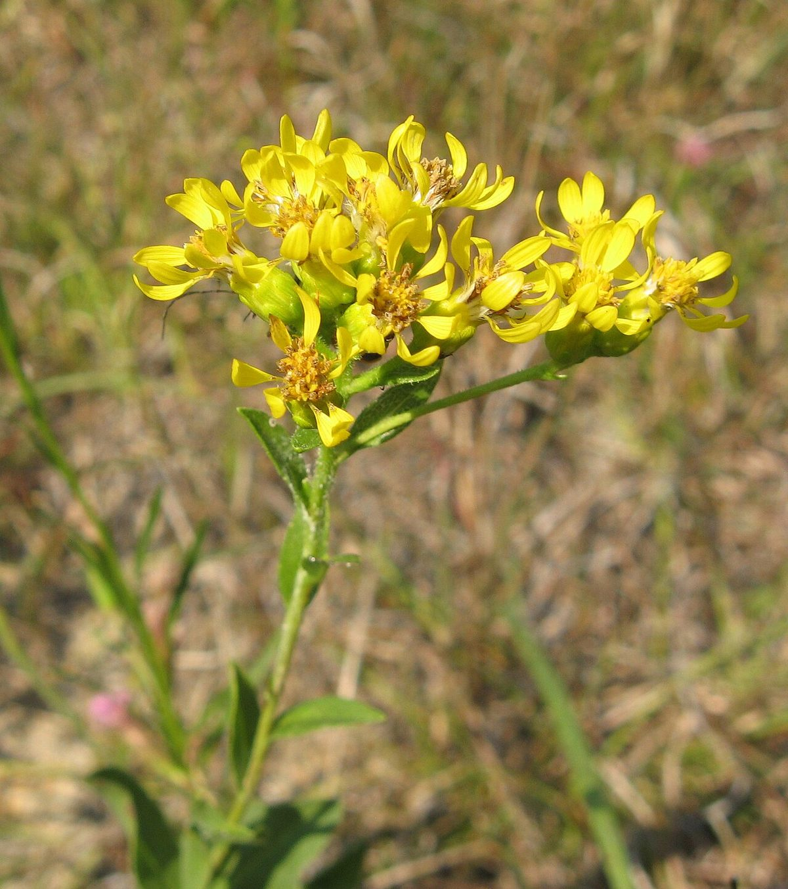

# Stiff Goldenrod

*Solidago rigida*

Solidago rigida, known by the common names stiff goldenrod and stiff-leaved goldenrod, is a North American plant species in the family Asteraceae. It has a widespread distribution in Canada and the United States, where it is found primarily east of the Rocky Mountains. It is typically found in open, dry areas associated with calcareous or sandy soil.

## Quick Facts

| | |
|---|---|
| **Scientific name** | *Solidago rigida* |
| **Family** | — |
| **Height** | — |
| **Bloom time** | — |
| **Sun** | — |
| **Moisture** | — |
| **Soil** | — |
| **Wildlife value** | — |

## Mentioned In

- [Pollinators Wildlife](../chapters/06-pollinators-wildlife/index.md)

## Image Credits

- Matt Lavin from Bozeman, Montana, USA (CC BY-SA 2.0)
- Mason Brock (Masebrock) (Public domain)

## Learn More

- [Wikipedia: Solidago rigida](https://en.wikipedia.org/wiki/Solidago_rigida)
