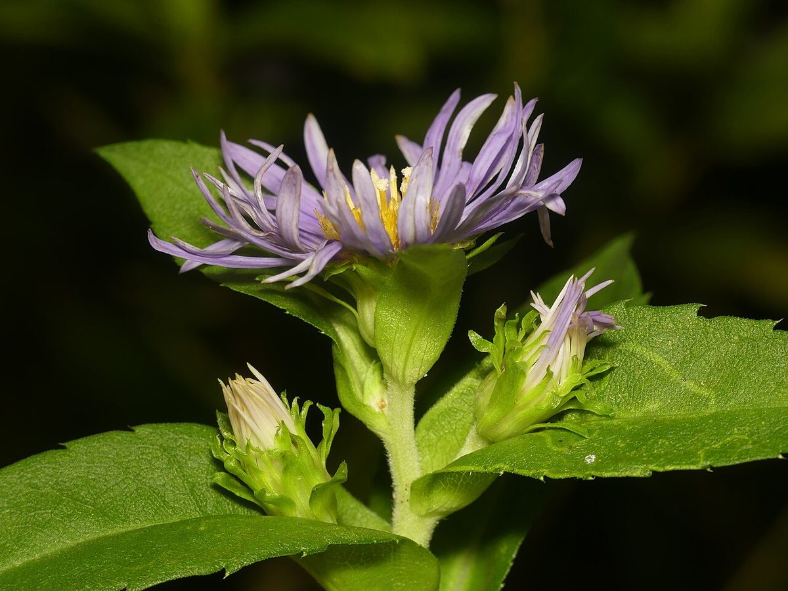

# Swamp Aster

*Symphyotrichum puniceum*

Symphyotrichum puniceum (formerly Aster puniceus), is a species of flowering plant in the family Asteraceae native to eastern North America. It is commonly known as purplestem aster, red-stalk aster, red-stemmed aster, red-stem aster, and swamp aster. It also has been called early purple aster, cocash, swanweed, and  meadow scabish.

## Quick Facts

| | |
|---|---|
| **Scientific name** | *Symphyotrichum puniceum* |
| **Family** | — |
| **Height** | — |
| **Bloom time** | — |
| **Sun** | — |
| **Moisture** | — |
| **Soil** | — |
| **Wildlife value** | — |

## Mentioned In

- [Ecological Restoration](../chapters/12-ecological-restoration/index.md)

## Image Credits

- University of Minnesota Bell Museum (CC0)
- Shaun Pogacnik (CC0)

## Learn More

- [Wikipedia: Symphyotrichum puniceum](https://en.wikipedia.org/wiki/Symphyotrichum_puniceum)
