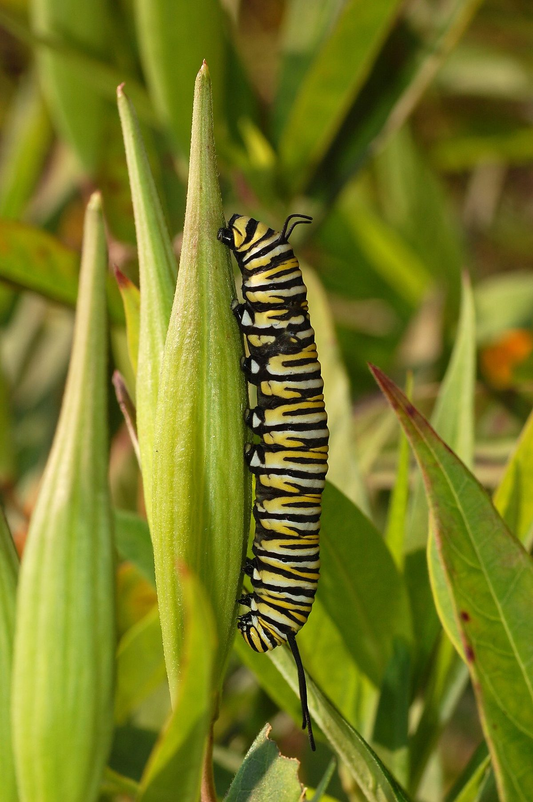

# Swamp Milkweed

*Asclepias incarnata*

Asclepias incarnata, the swamp milkweed, rose milkweed, rose milkflower, swamp silkweed, or white Indian hemp, is a herbaceous perennial plant species native to North America. It grows in damp through wet soils and also is cultivated as a garden plant for its flowers, which attract butterflies and other pollinators with nectar. Like most other milkweeds, it has latex containing toxic steroids, a characteristic that repels many species of insects and mammals.

## Quick Facts

| | |
|---|---|
| **Scientific name** | *Asclepias incarnata* |
| **Family** | — |
| **Height** | — |
| **Bloom time** | — |
| **Sun** | — |
| **Moisture** | — |
| **Soil** | — |
| **Wildlife value** | — |

## Mentioned In

- [Ecoregions Growing Conditions](../chapters/02-ecoregions-growing-conditions/index.md)
- [Wetland Shoreline Plants](../chapters/05-wetland-shoreline-plants/index.md)

## Image Credits

- ThatLexingtonKyGuy (CC BY-SA 4.0)
- Photo (c)2007 Derek Ramsey (Ram-Man) (GFDL 1.2)

## Learn More

- [Wikipedia: Asclepias incarnata](https://en.wikipedia.org/wiki/Asclepias_incarnata)
