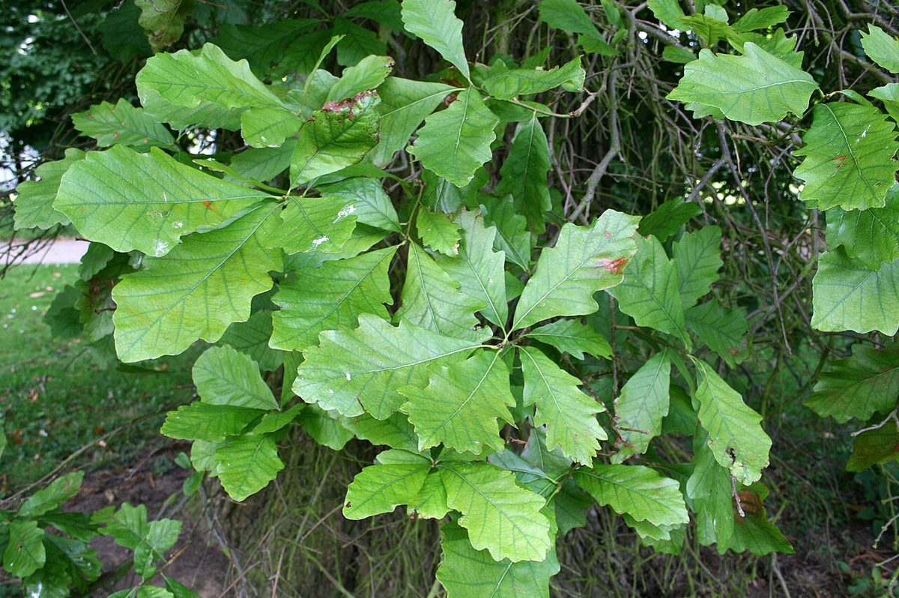

# Swamp White Oak

*Quercus bicolor*

Quercus bicolor, the swamp white oak, is a North American species of medium-sized trees in the beech family. It is a common element of America's north central and northeastern mixed forests. It can survive in a variety of habitats.

## Quick Facts

| | |
|---|---|
| **Scientific name** | *Quercus bicolor* |
| **Family** | — |
| **Height** | — |
| **Bloom time** | — |
| **Sun** | — |
| **Moisture** | — |
| **Soil** | — |
| **Wildlife value** | — |

## Mentioned In

- [Wetland Shoreline Plants](../chapters/05-wetland-shoreline-plants/index.md)

## Image Credits

- Jean-Pol GRANDMONT (CC BY 3.0)

## Learn More

- [Wikipedia: Quercus bicolor](https://en.wikipedia.org/wiki/Quercus_bicolor)
