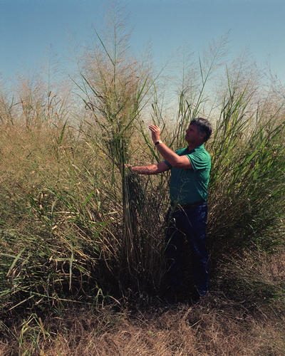

# Switchgrass

*Panicum virgatum*

Panicum virgatum, commonly known as switchgrass and panic grass, is a perennial warm season bunchgrass native to North America, where it occurs naturally from 55°N latitude in Canada southwards into the United States and Mexico. Switchgrass is one of the dominant species of the central North American tallgrass prairie and can be found in remnant prairies, in native grass pastures, and naturalized along roadsides. It is used primarily for soil conservation, forage production, game cover, as an ornamental grass, in phytoremediation projects, fiber, electricity, heat production, for biosequestration of atmospheric carbon dioxide, and more recently as a biomass crop for the production of ethanol and butanol.

## Quick Facts

| | |
|---|---|
| **Scientific name** | *Panicum virgatum* |
| **Family** | — |
| **Height** | — |
| **Bloom time** | — |
| **Sun** | — |
| **Moisture** | — |
| **Soil** | — |
| **Wildlife value** | — |

## Mentioned In

- [Prairie Plants Grasslands](../chapters/03-prairie-plants-grasslands/index.md)
- [Wetland Shoreline Plants](../chapters/05-wetland-shoreline-plants/index.md)

## Image Credits

- Chhe (talk) (Public domain)
- Warren Gretz, DOE/NREL (Public domain)

## Learn More

- [Wikipedia: Panicum virgatum](https://en.wikipedia.org/wiki/Panicum_virgatum)
