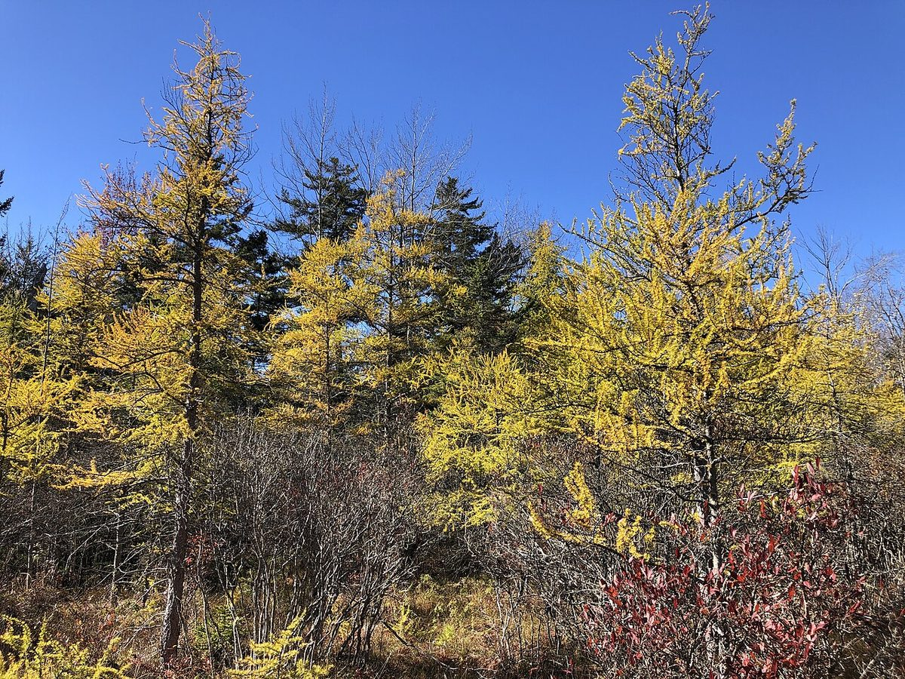

# Tamarack

*Larix laricina*

Larix laricina, commonly known as the tamarack, hackmatack, eastern larch, black larch, red larch, or American larch, is a species of larch native to Canada, from eastern Yukon and Inuvik, Northwest Territories east to Newfoundland, and also south into the upper northeastern United States from Minnesota to Cranesville Swamp, West Virginia; there is also an isolated population in central Alaska.

## Quick Facts

| | |
|---|---|
| **Scientific name** | *Larix laricina* |
| **Family** | — |
| **Height** | — |
| **Bloom time** | — |
| **Sun** | — |
| **Moisture** | — |
| **Soil** | — |
| **Wildlife value** | — |

## Mentioned In

- [Ecoregions Growing Conditions](../chapters/02-ecoregions-growing-conditions/index.md)
- [Wetland Shoreline Plants](../chapters/05-wetland-shoreline-plants/index.md)

## Image Credits

- Famartin (CC BY-SA 4.0)
- Famartin (CC BY-SA 4.0)

## Learn More

- [Wikipedia: Larix laricina](https://en.wikipedia.org/wiki/Larix_laricina)
