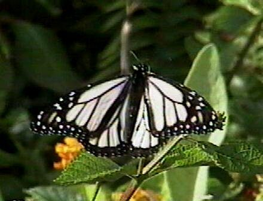
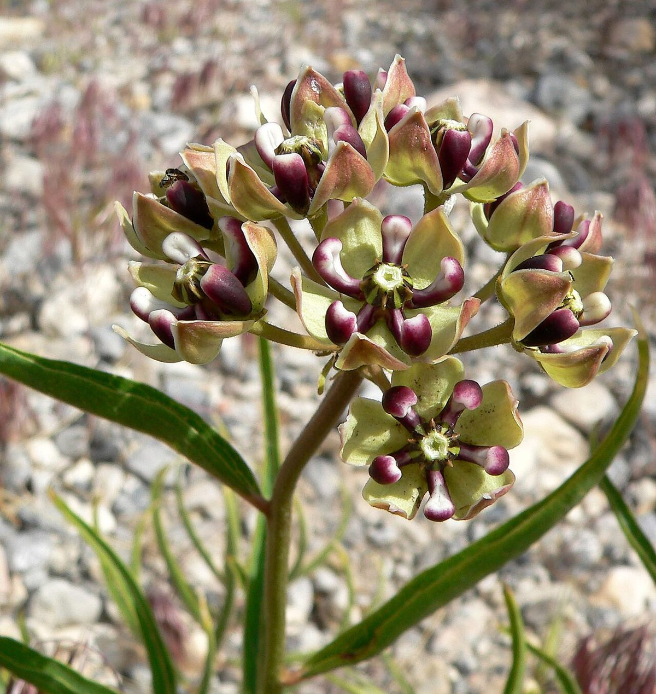

# The Monarch Butterfly

*Danaus plexippus*

The monarch butterfly or simply monarch (Danaus plexippus) is a milkweed butterfly (subfamily Danainae) in the family Nymphalidae. Other common names, depending on region, include milkweed, common tiger, wanderer, and black-veined brown. It is among the most familiar of North American butterflies and an iconic pollinator, although it is not an especially effective pollinator of milkweeds.

## Quick Facts

| | |
|---|---|
| **Scientific name** | *Danaus plexippus* |
| **Family** | Nymphalidae |
| **Type** | Butterfly |
| **Status** | Native; IUCN listed, candidate for US listing |
| **Active season** | May-Oct in Minnesota |
| **What it needs** | Milkweed (Asclepias) for caterpillars - nothing else will do; nectar plants through September for the migrating generation |
| **Where in Minnesota** | Statewide; prairies and roadsides of western and southern Minnesota are core breeding habitat |

## Mentioned In

- [Pollinators Wildlife](../chapters/06-pollinators-wildlife/index.md)

## Image Credits

- Vogbank at English Wikipedia, cropped by Fvasconcellos (talk · contribs) (Public domain)
- Stan Shebs (CC BY-SA 3.0)

## Learn More

- [Wikipedia: Monarch butterfly](https://en.wikipedia.org/wiki/Monarch_butterfly)
