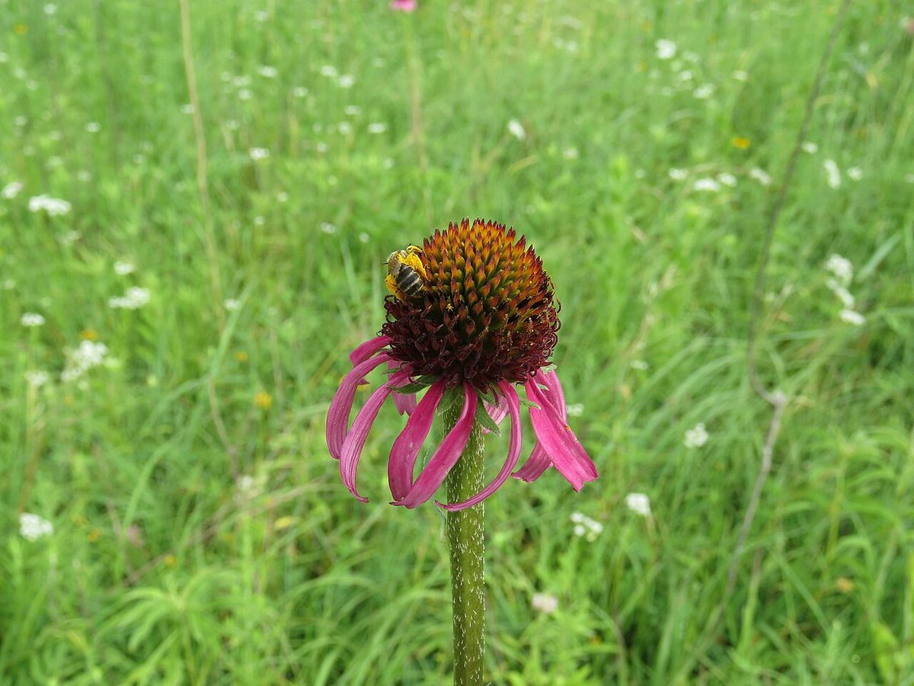
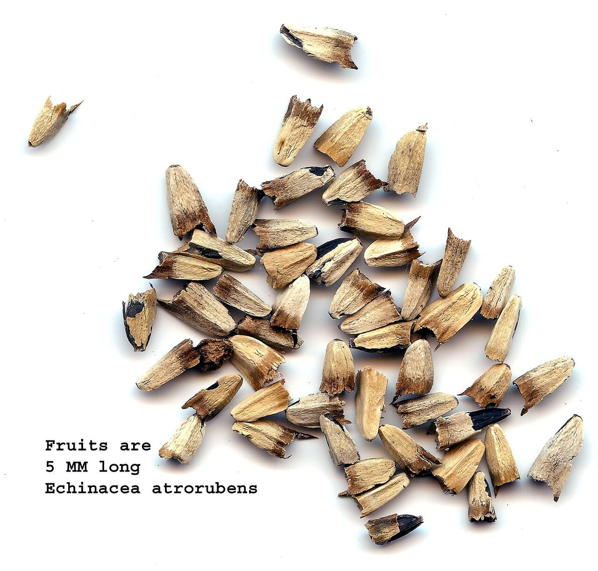

# Topeka Purple Coneflower

*Echinacea atrorubens*

Echinacea atrorubens, called the Topeka purple coneflower, is a North American species of flowering plant in the family Asteraceae. It is native to eastern Kansas, Oklahoma, and eastern Texas in the south-central United States. It is found growing in dry soils around limestone or sandstone outcroppings and prairies.

## Quick Facts

| | |
|---|---|
| **Scientific name** | *Echinacea atrorubens* |
| **Family** | — |
| **Height** | — |
| **Bloom time** | — |
| **Sun** | — |
| **Moisture** | — |
| **Soil** | — |
| **Wildlife value** | — |

## Mentioned In

- [Prairie Plants Grasslands](../chapters/03-prairie-plants-grasslands/index.md)

## Image Credits

- henrya (CC0)
- User:Hardyplants (Public domain)

## Learn More

- [Wikipedia: Echinacea atrorubens](https://en.wikipedia.org/wiki/Echinacea_atrorubens)
