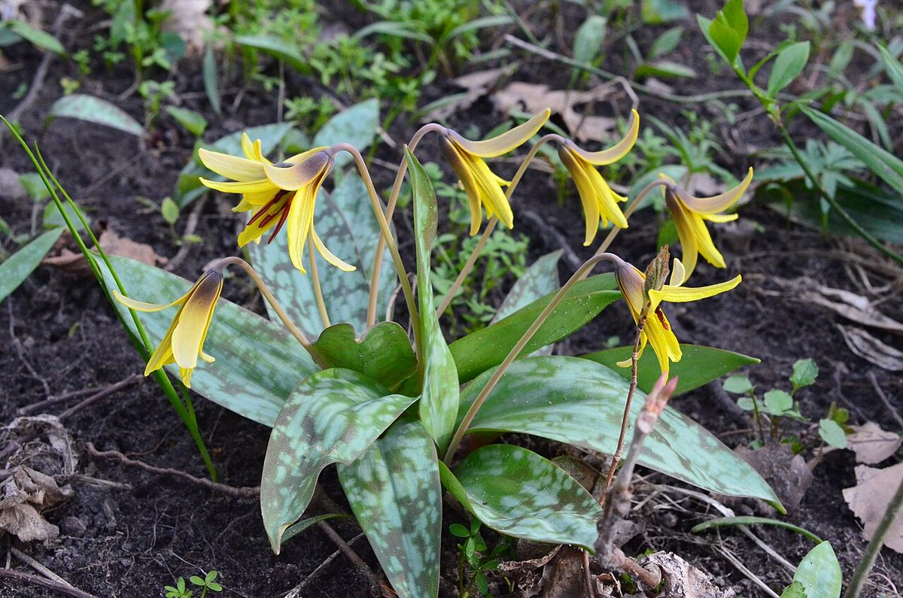

# Trout Lily

*Erythronium americanum*

Erythronium americanum, the trout lily, yellow trout lily, fawn lily, yellow adder's-tongue, or yellow dogtooth violet, is a species of perennial, colony forming, spring ephemeral flower native to North America and dwelling in woodland habitats. Within its range it is a very common and widespread species, especially in eastern North America. The common name "trout lily" refers to the appearance of its gray-green leaves mottled with brown or gray, which allegedly resemble the coloring of brook trout.

## Quick Facts

| | |
|---|---|
| **Scientific name** | *Erythronium americanum* |
| **Family** | — |
| **Height** | — |
| **Bloom time** | — |
| **Sun** | — |
| **Moisture** | — |
| **Soil** | — |
| **Wildlife value** | — |

## Mentioned In

- [Ecological Restoration](../chapters/12-ecological-restoration/index.md)

## Image Credits

- U. S. Department of Agriculture. (Public domain)
- Mttswa (CC BY-SA 4.0)

## Learn More

- [Wikipedia: Erythronium americanum](https://en.wikipedia.org/wiki/Erythronium_americanum)
