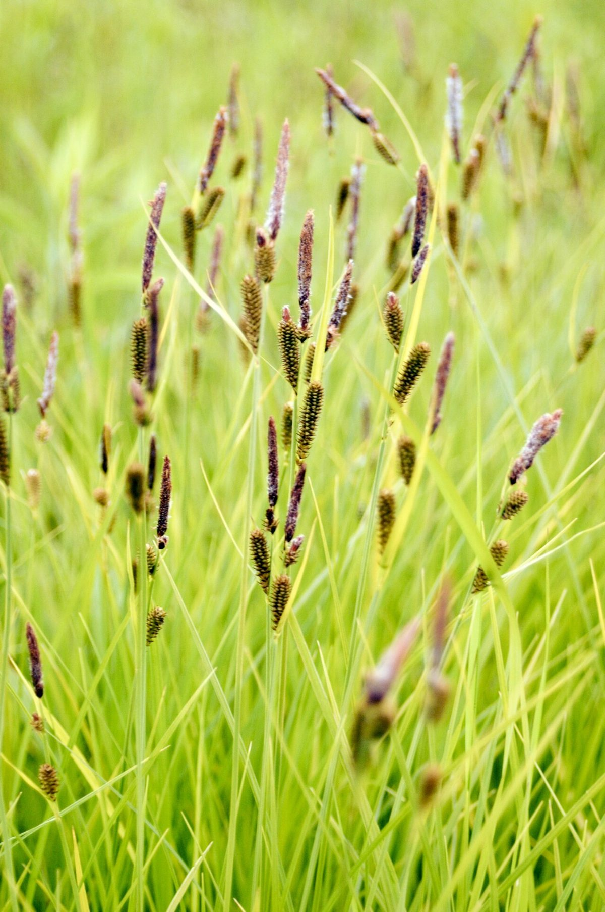

# Tussock Sedge

*Carex stricta*

Carex stricta is a species of sedge known by the common names upright sedge and tussock sedge. The plant grows in moist marshes, forests and alongside bodies of water. It grows up to 2 feet (0.61 m) tall and 2 feet (0.61 m) wide.

## Quick Facts

| | |
|---|---|
| **Scientific name** | *Carex stricta* |
| **Family** | — |
| **Height** | — |
| **Bloom time** | — |
| **Sun** | — |
| **Moisture** | — |
| **Soil** | — |
| **Wildlife value** | — |

## Mentioned In

- [Wetland Shoreline Plants](../chapters/05-wetland-shoreline-plants/index.md)

## Image Credits

- gmayfield10 (CC BY-SA 2.0)

## Learn More

- [Wikipedia: Carex stricta](https://en.wikipedia.org/wiki/Carex_stricta)
