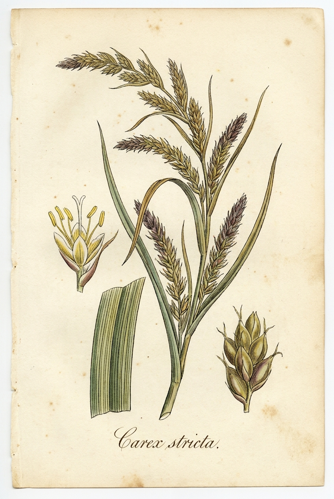
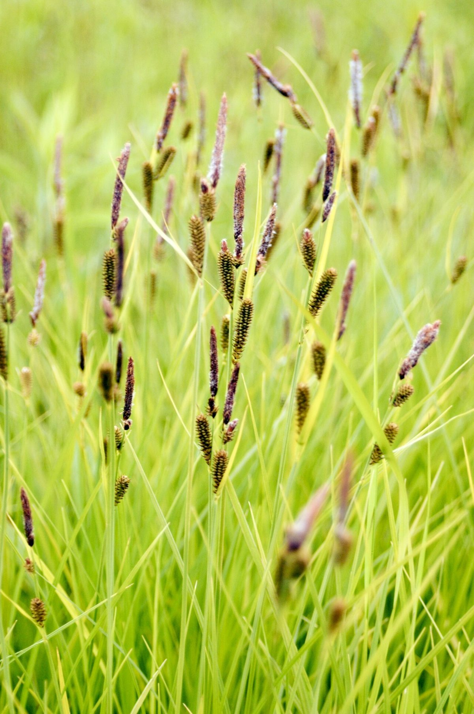

# Tussock Sedge

*Carex stricta*

{ .plant-illustration }

*Botanical plate of* **Carex stricta** *— Curtis-style illustration.*

Carex stricta is a species of sedge known by the common names upright sedge and tussock sedge. The plant grows in moist marshes, forests and alongside bodies of water. It grows up to 2 feet (0.61 m) tall and 2 feet (0.61 m) wide.

## Quick Facts

| | |
|---|---|
| **Scientific name** | *Carex stricta* |
| **Family** | Cyperaceae |
| **Height** | 2-3 ft |
| **Bloom time** | May-Jun |
| **Sun** | Full sun to part shade |
| **Moisture** | Wet |
| **Soil** | Muck |
| **Wildlife value** | Builds raised pedestals that shelter frogs and nesting birds; the sedge-meadow keystone |

## Mentioned In

- [Wetland Shoreline Plants](../chapters/05-wetland-shoreline-plants/index.md)
- [Plant Identification Skills](../chapters/07-plant-identification-skills/index.md)
- [Garden Design Native Plants](../chapters/10-garden-design-native-plants/index.md)

## Image Credits

- gmayfield10 (CC BY-SA 2.0)

## Learn More

- [Wikipedia: Carex stricta](https://en.wikipedia.org/wiki/Carex_stricta)
