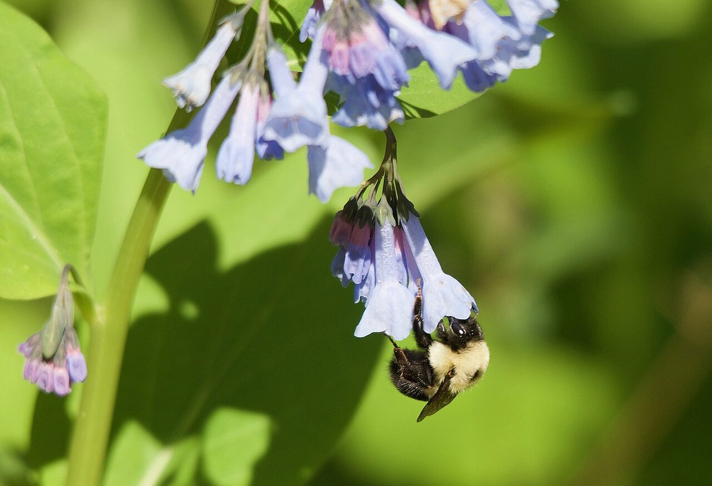

# Virginia Bluebells

*Mertensia virginica*

Mertensia virginica (common names Virginia bluebells, Virginia cowslip, lungwort oysterleaf, Roanoke bells) is a spring ephemeral plant in the Boraginaceae (borage) family with bell-shaped sky-blue flowers, native to eastern North America.

## Quick Facts

| | |
|---|---|
| **Scientific name** | *Mertensia virginica* |
| **Family** | — |
| **Height** | — |
| **Bloom time** | — |
| **Sun** | — |
| **Moisture** | — |
| **Soil** | — |
| **Wildlife value** | — |

## Mentioned In

- [Pollinators Wildlife](../chapters/06-pollinators-wildlife/index.md)
- [Garden Design Native Plants](../chapters/10-garden-design-native-plants/index.md)

## Image Credits

- Amos Oliver Doyle (CC BY-SA 3.0)
- Correlated alembic (CC BY-SA 4.0)

## Learn More

- [Wikipedia: Mertensia virginica](https://en.wikipedia.org/wiki/Mertensia_virginica)
