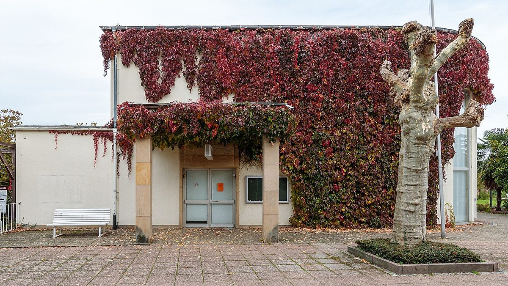

# Virginia Creeper

*Parthenocissus quinquefolia*

Parthenocissus quinquefolia, commonly known as Virginia creeper, woodbine, five-leaved ivy, or five-finger, is a species of flowering vine in the grape family Vitaceae.
The species is native to eastern and central North America, with its range extending from south-eastern Canada and the eastern United States, west to Manitoba and Utah, and as far south as eastern Mexico and Guatemala. It has been introduced globally and is considered an invasive species to varying degrees in the European Union, the United Kingdom, China, Australia, and Cuba.

## Quick Facts

| | |
|---|---|
| **Scientific name** | *Parthenocissus quinquefolia* |
| **Family** | — |
| **Height** | — |
| **Bloom time** | — |
| **Sun** | — |
| **Moisture** | — |
| **Soil** | — |
| **Wildlife value** | — |

## Mentioned In

- [Woodland Forest Plants](../chapters/04-woodland-forest-plants/index.md)
- [Ecological Restoration](../chapters/12-ecological-restoration/index.md)

## Image Credits

- Mick Stephenson mixpix 16:18, 19 March 2007 (UTC) (CC BY-SA 3.0)
- Friedrich Haag (CC BY-SA 4.0)

## Learn More

- [Wikipedia: Parthenocissus quinquefolia](https://en.wikipedia.org/wiki/Parthenocissus_quinquefolia)
