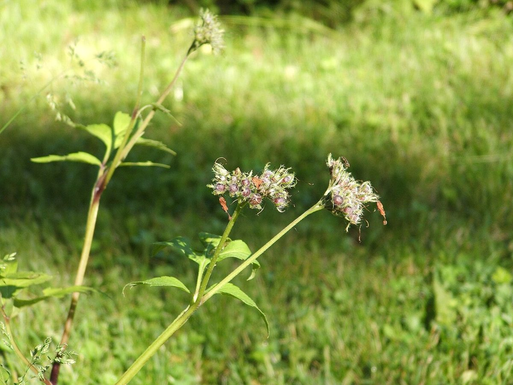

# Virginia Waterleaf

*Hydrophyllum virginianum*

Hydrophyllum virginianum, commonly called Virginia waterleaf or eastern waterleaf, is an herbaceous perennial plant native to Eastern North America where it is primarily found in the Midwest, Northeast, and Appalachian regions. The genus Hydrophyllum is placed in the family Hydrophyllaceae.
Its natural habitat is in bottomland forests, mesic upland forests, and rocky forested bluffs.

## Quick Facts

| | |
|---|---|
| **Scientific name** | *Hydrophyllum virginianum* |
| **Family** | — |
| **Height** | — |
| **Bloom time** | — |
| **Sun** | — |
| **Moisture** | — |
| **Soil** | — |
| **Wildlife value** | — |

## Mentioned In

- [Woodland Forest Plants](../chapters/04-woodland-forest-plants/index.md)

## Image Credits

- Mason Brock (Masebrock) (Public domain)
- Douglas W. Jones (Public domain)

## Learn More

- [Wikipedia: Hydrophyllum virginianum](https://en.wikipedia.org/wiki/Hydrophyllum_virginianum)
