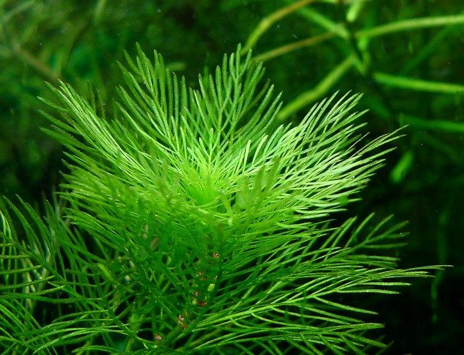
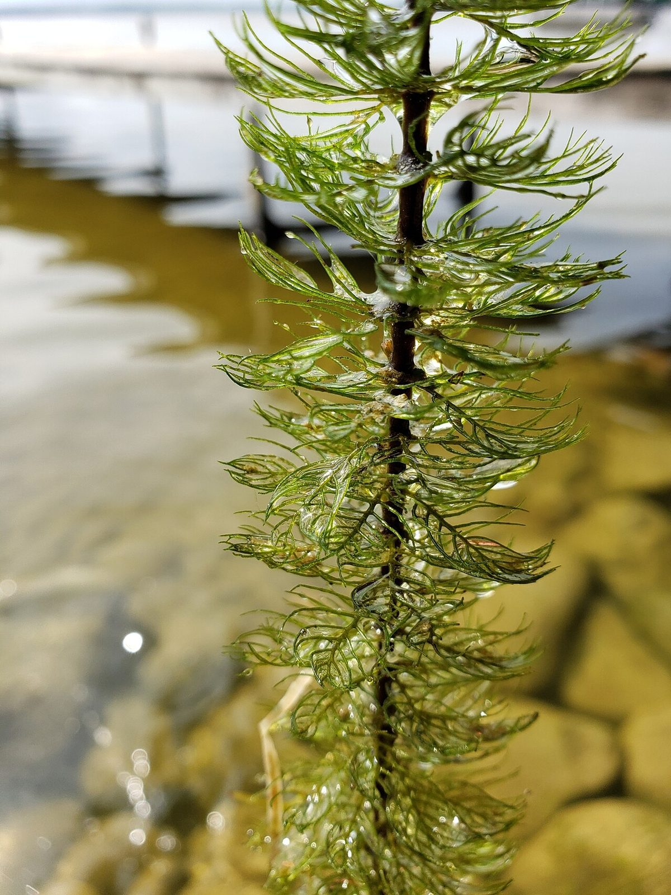

# Water Milfoil

*Myriophyllum sibiricum*

Myriophyllum sibiricum is a species of water milfoil known by the common names shortspike watermilfoil, northern watermilfoil, and Siberian water-milfoil. It is native to Russia, China, and much of North America, where it grows in aquatic habitat such as ponds and streams. It generally grows over a meter long, its green stem drying white.

## Quick Facts

| | |
|---|---|
| **Scientific name** | *Myriophyllum sibiricum* |
| **Family** | — |
| **Height** | — |
| **Bloom time** | — |
| **Sun** | — |
| **Moisture** | — |
| **Soil** | — |
| **Wildlife value** | — |

## Mentioned In

- [Wetland Shoreline Plants](../chapters/05-wetland-shoreline-plants/index.md)

## Image Credits

- TsunamiCarlos (Public domain)
- Sharika Elahi (CC0)

## Learn More

- [Wikipedia: Myriophyllum sibiricum](https://en.wikipedia.org/wiki/Myriophyllum_sibiricum)
