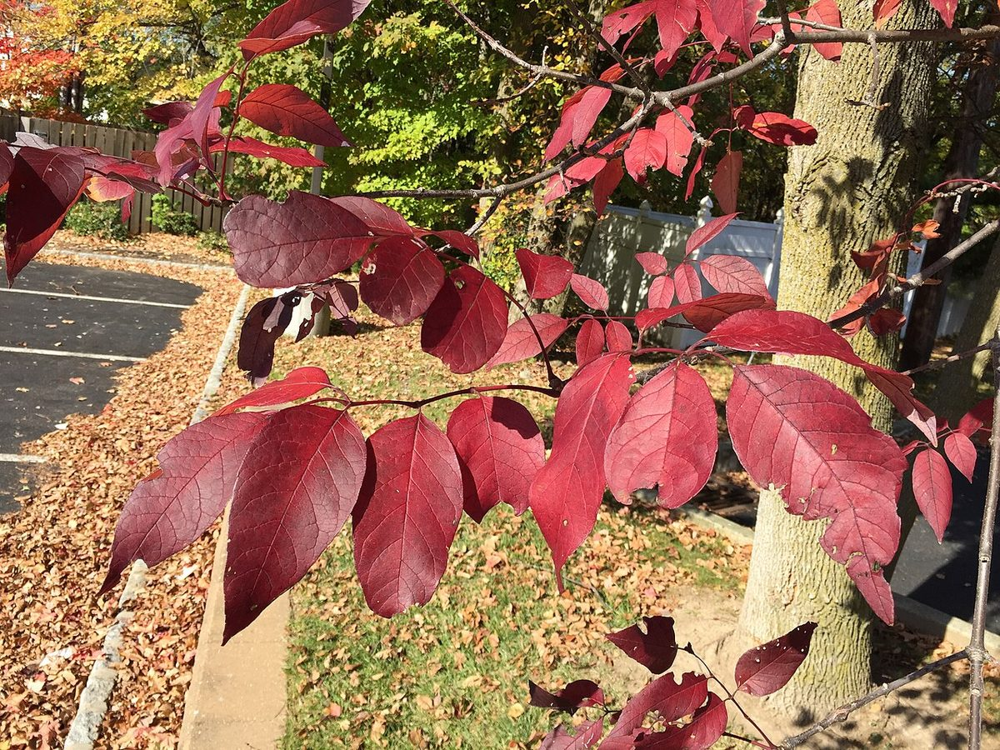
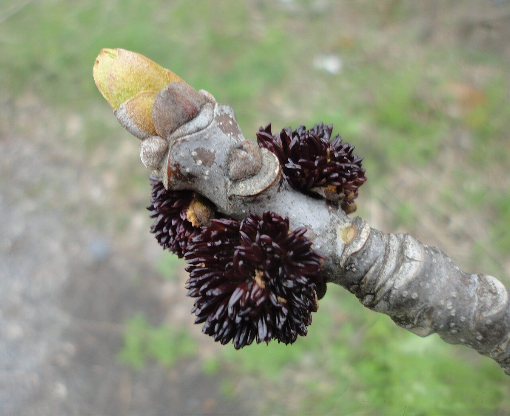

# White Ash

*Fraxinus americana*

Fraxinus americana, the white ash or American ash, is a fast-growing species of ash tree native to eastern and central North America. The tree is highly valued as lumber.
The white ash population in North America was devastated by the invasive emerald ash borer, which killed hundreds of millions of them as it spread during the 1990s–2010s.

## Quick Facts

| | |
|---|---|
| **Scientific name** | *Fraxinus americana* |
| **Family** | — |
| **Height** | — |
| **Bloom time** | — |
| **Sun** | — |
| **Moisture** | — |
| **Soil** | — |
| **Wildlife value** | — |

## Mentioned In

- [Invasive Species Id](../chapters/08-invasive-species-id/index.md)

## Image Credits

- Famartin (CC BY-SA 4.0)
- Caromallo (CC BY-SA 3.0)

## Learn More

- [Wikipedia: Fraxinus americana](https://en.wikipedia.org/wiki/Fraxinus_americana)
