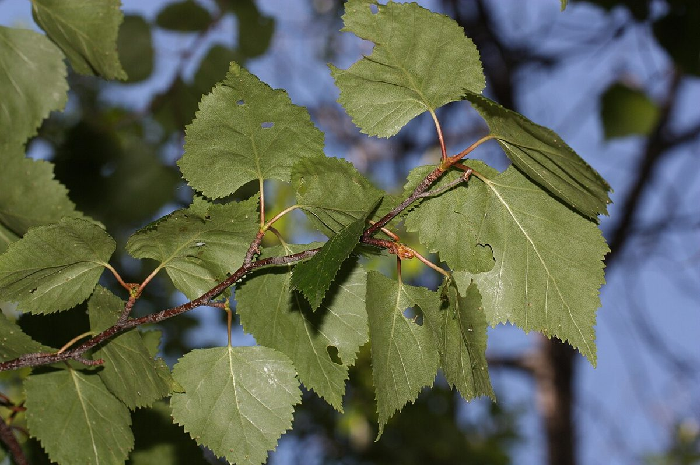

# White Birch

*Betula papyrifera*

Betula papyrifera (paper birch, also known as (American) white birch and canoe birch) is a short-lived species of birch native to northern North America. Paper birch is named after the tree's thin white bark, which often peels in paper-like layers from the trunk. Paper birch is often one of the first species to colonize a burned area within the northern latitudes, and is an important species for moose browsing.

## Quick Facts

| | |
|---|---|
| **Scientific name** | *Betula papyrifera* |
| **Family** | — |
| **Height** | — |
| **Bloom time** | — |
| **Sun** | — |
| **Moisture** | — |
| **Soil** | — |
| **Wildlife value** | — |

## Mentioned In

- [Ecoregions Growing Conditions](../chapters/02-ecoregions-growing-conditions/index.md)
- [Woodland Forest Plants](../chapters/04-woodland-forest-plants/index.md)
- [Plant Identification Skills](../chapters/07-plant-identification-skills/index.md)
- [Ecological Restoration](../chapters/12-ecological-restoration/index.md)
- [Cultural Indigenous Uses](../chapters/13-cultural-indigenous-uses/index.md)

## Image Credits

- InAweofGod'sCreation (CC BY 2.0)
- Walter Siegmund (talk) (CC BY-SA 3.0)

## Learn More

- [Wikipedia: Betula papyrifera](https://en.wikipedia.org/wiki/Betula_papyrifera)
