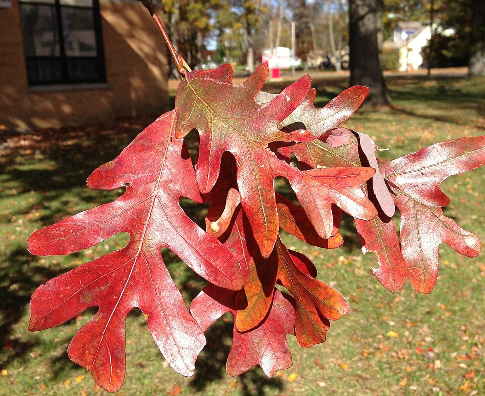

# White Oak

*Quercus alba*

Quercus alba, the white oak, is one of the preeminent hardwoods of eastern and central North America. It is a long-lived oak, native to eastern and central North America and found from Minnesota, Ontario, Quebec, and southern Maine south as far as northern Florida and eastern Texas. Specimens have been documented to be over 450 years old.

## Quick Facts

| | |
|---|---|
| **Scientific name** | *Quercus alba* |
| **Family** | — |
| **Height** | — |
| **Bloom time** | — |
| **Sun** | — |
| **Moisture** | — |
| **Soil** | — |
| **Wildlife value** | — |

## Mentioned In

- [Woodland Forest Plants](../chapters/04-woodland-forest-plants/index.md)

## Image Credits

- Famartin (CC BY-SA 3.0)
- Famartin (CC BY-SA 4.0)

## Learn More

- [Wikipedia: Quercus alba](https://en.wikipedia.org/wiki/Quercus_alba)
