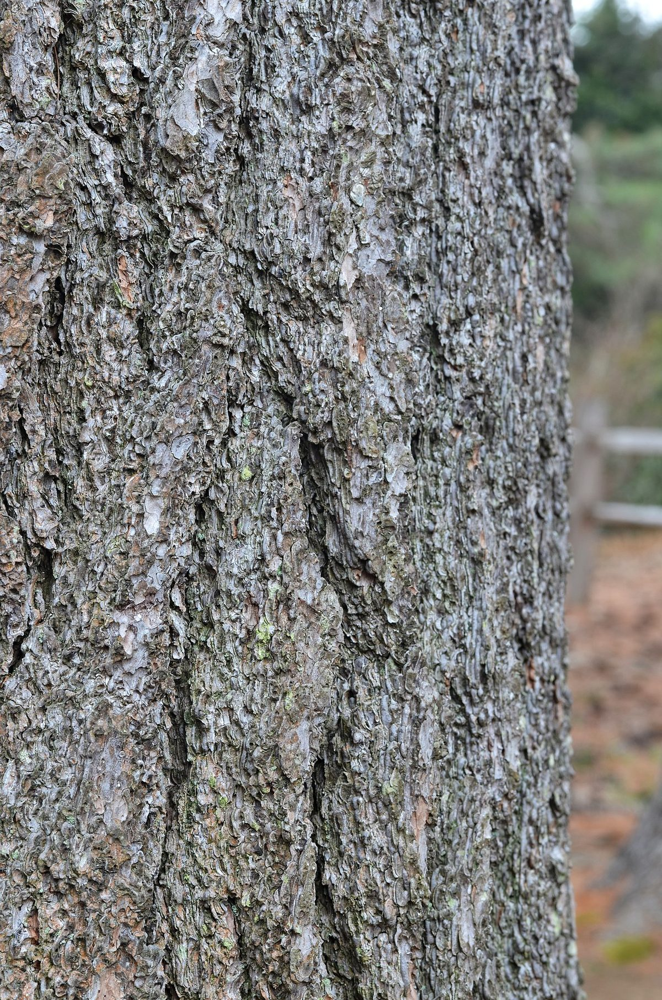
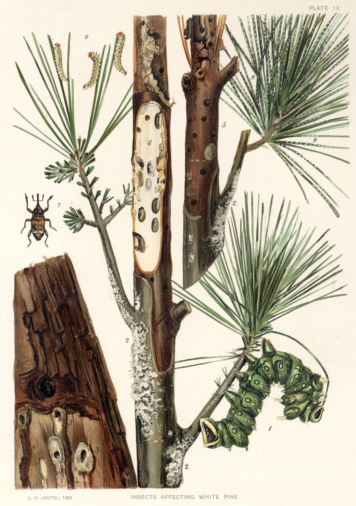

# White Pine

*Pinus strobus*

Pinus strobus, commonly called the eastern white pine, northern white pine, white pine, Weymouth pine (British), and soft pine is a large pine native to eastern North America. It occurs from Newfoundland, Canada, west through the Great Lakes region to southeastern Manitoba and Minnesota, United States, and south along the Appalachian Mountains and upper Piedmont to northernmost Georgia and very rare in some of the higher elevations in northeastern Alabama. It is considered rare in Indiana.

## Quick Facts

| | |
|---|---|
| **Scientific name** | *Pinus strobus* |
| **Family** | — |
| **Height** | — |
| **Bloom time** | — |
| **Sun** | — |
| **Moisture** | — |
| **Soil** | — |
| **Wildlife value** | — |

## Mentioned In

- [Woodland Forest Plants](../chapters/04-woodland-forest-plants/index.md)

## Image Credits

- Photo by and (c)2016 Derek Ramsey (Ram-Man) (CC BY-SA 4.0)
- L. H. Joutel (PD-US)

## Learn More

- [Wikipedia: Pinus strobus](https://en.wikipedia.org/wiki/Pinus_strobus)
