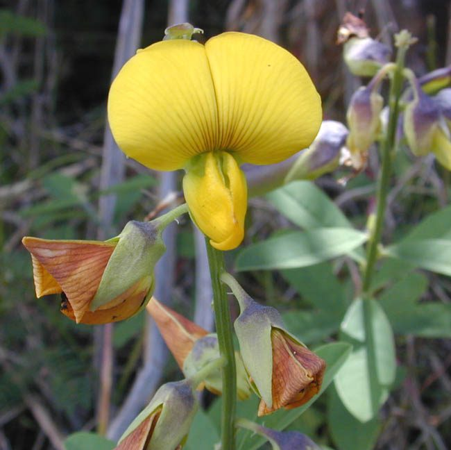
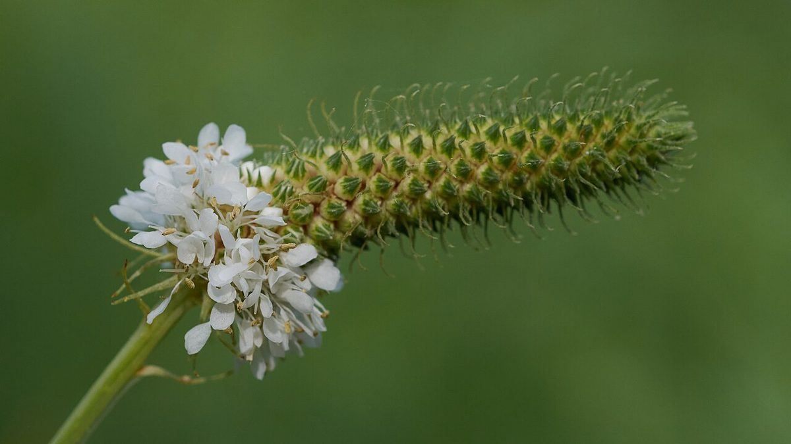

# White Prairie Clover

*Dalea candida*

Dalea candida is a species of flowering plant in the legume family known by the common name white prairie clover. It is native to North America, where it can be found throughout central Canada, the central United States, and northern Mexico. It can sometimes be found outside its range as an introduced species.

## Quick Facts

| | |
|---|---|
| **Scientific name** | *Dalea candida* |
| **Family** | — |
| **Height** | — |
| **Bloom time** | — |
| **Sun** | — |
| **Moisture** | — |
| **Soil** | — |
| **Wildlife value** | — |

## Mentioned In

- [Prairie Plants Grasslands](../chapters/03-prairie-plants-grasslands/index.md)

## Image Credits

- Marshman at English Wikipedia / Eric Guinther (CC BY-SA 3.0)
- Eric in SF (CC BY 4.0)

## Learn More

- [Wikipedia: Dalea candida](https://en.wikipedia.org/wiki/Dalea_candida)
