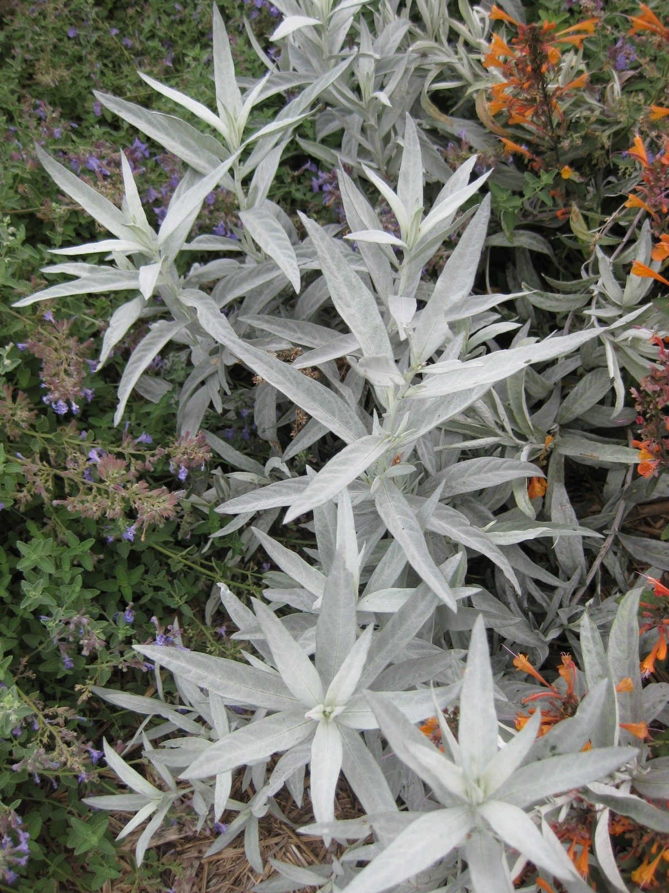

# White Sage

*Artemisia ludoviciana*

Artemisia ludoviciana is a North American species of flowering plant in the daisy family Asteraceae, known by several common names, including silver wormwood, western mugwort, Louisiana wormwood, white sagebrush, lobed cud-weed, prairie sage, and gray sagewort. 
Ludoviciana is the Latinized version of the word Louisiana.

## Quick Facts

| | |
|---|---|
| **Scientific name** | *Artemisia ludoviciana* |
| **Family** | — |
| **Height** | — |
| **Bloom time** | — |
| **Sun** | — |
| **Moisture** | — |
| **Soil** | — |
| **Wildlife value** | — |

## Mentioned In

- [Cultural Indigenous Uses](../chapters/13-cultural-indigenous-uses/index.md)

## Image Credits

- Stan Shebs (CC BY-SA 3.0)
- Raffi Kojian (CC BY-SA 3.0)

## Learn More

- [Wikipedia: Artemisia ludoviciana](https://en.wikipedia.org/wiki/Artemisia_ludoviciana)
