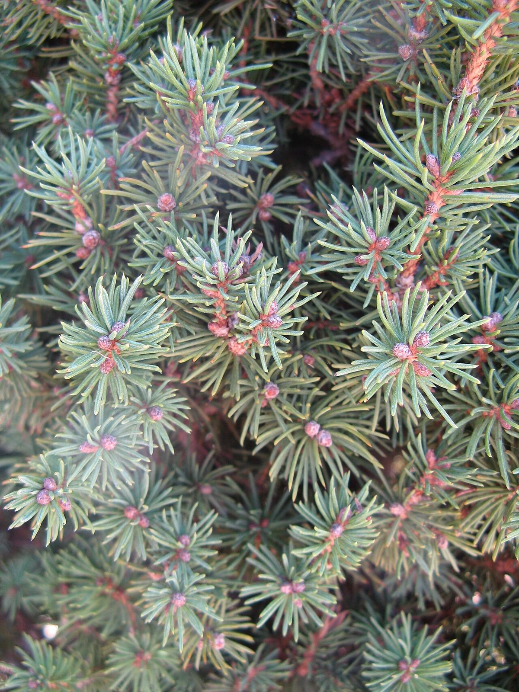

# White Spruce

*Picea glauca*

Picea glauca, the white spruce, is a species of spruce native to the northern temperate and boreal forests in Canada and United States, North America.
Picea glauca is native from central Alaska all through the east, across western and southern/central Canada to the Avalon Peninsula in Newfoundland, Quebec, Ontario and south to Montana, North Dakota, Minnesota, Wisconsin, Michigan, Upstate New York and Vermont, along with the mountainous and immediate coastal portions of New Hampshire and Maine, where temperatures are just barely cool and moist enough to support it. There is also an isolated population in the Black Hills of South Dakota and Wyoming.

## Quick Facts

| | |
|---|---|
| **Scientific name** | *Picea glauca* |
| **Family** | — |
| **Height** | — |
| **Bloom time** | — |
| **Sun** | — |
| **Moisture** | — |
| **Soil** | — |
| **Wildlife value** | — |

## Mentioned In

- [Ecoregions Growing Conditions](../chapters/02-ecoregions-growing-conditions/index.md)
- [Ecological Restoration](../chapters/12-ecological-restoration/index.md)

## Image Credits

- Daniel Dumais (CC BY-SA 4.0)
- Geographer (CC BY-SA 3.0)

## Learn More

- [Wikipedia: Picea glauca](https://en.wikipedia.org/wiki/Picea_glauca)
