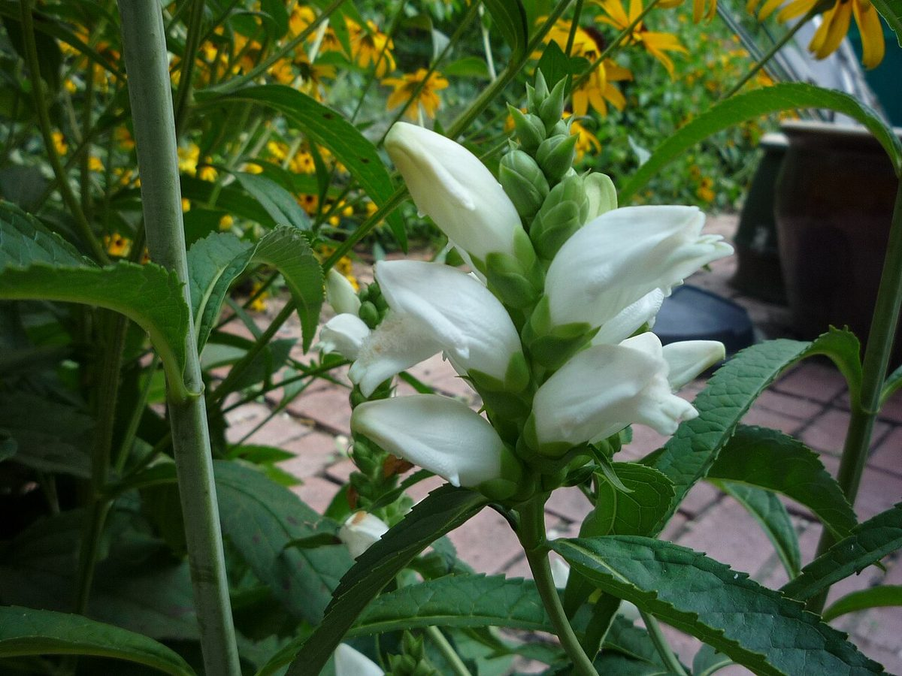
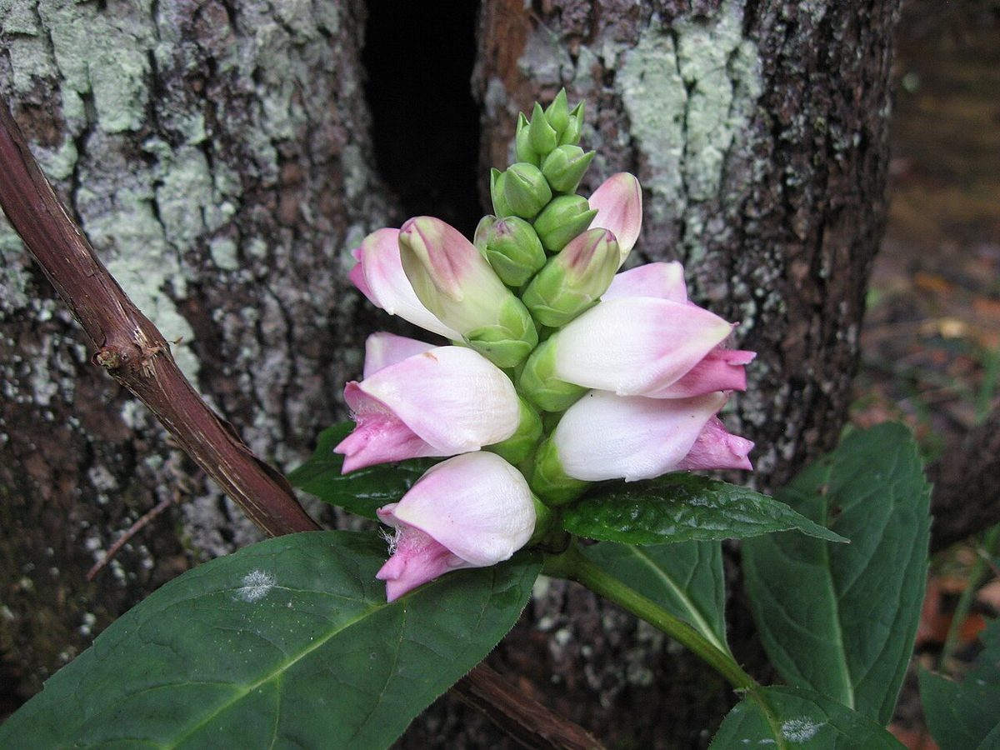

# White Turtlehead

*Chelone glabra*

Chelone glabra, or white turtlehead, is a herbaceous species of plant native to North America. Its native range extends from Georgia to Newfoundland and Labrador and from Mississippi to Manitoba. Its common name comes from the appearance of its flower petals, which resemble the head of a tortoise.

## Quick Facts

| | |
|---|---|
| **Scientific name** | *Chelone glabra* |
| **Family** | — |
| **Height** | — |
| **Bloom time** | — |
| **Sun** | — |
| **Moisture** | — |
| **Soil** | — |
| **Wildlife value** | — |

## Mentioned In

- [Pollinators Wildlife](../chapters/06-pollinators-wildlife/index.md)

## Image Credits

- Jim Kingdon (Kingdon (talk)) (Public domain)
- Mason Brock (Masebrock) (Public domain)

## Learn More

- [Wikipedia: Chelone glabra](https://en.wikipedia.org/wiki/Chelone_glabra)
