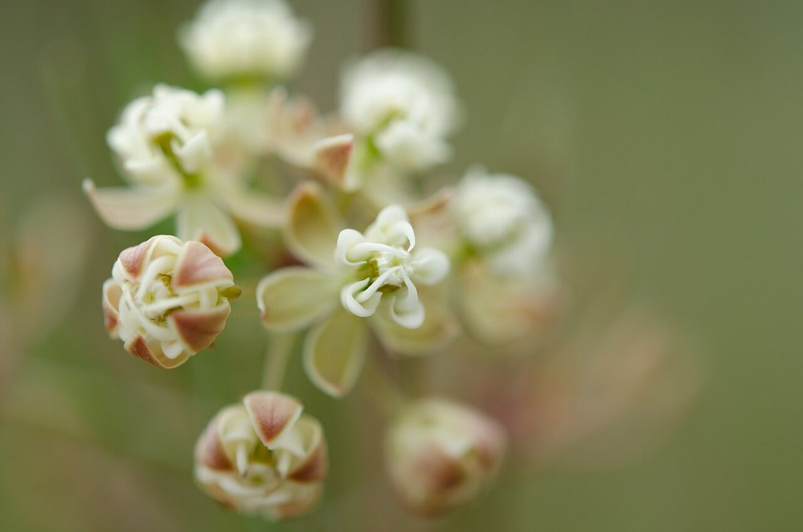

# Whorled Milkweed

*Asclepias verticillata*

Asclepias verticillata, the whorled milkweed, eastern whorled milkweed, or horsetail milkweed, is a species of milkweed native to most of eastern North America and parts of western Canada and the United States.

## Quick Facts

| | |
|---|---|
| **Scientific name** | *Asclepias verticillata* |
| **Family** | — |
| **Height** | — |
| **Bloom time** | — |
| **Sun** | — |
| **Moisture** | — |
| **Soil** | — |
| **Wildlife value** | — |

## Mentioned In

- [Prairie Plants Grasslands](../chapters/03-prairie-plants-grasslands/index.md)
- [Pollinators Wildlife](../chapters/06-pollinators-wildlife/index.md)

## Image Credits

- Eric Hunt (CC BY-SA 4.0)
- Mark Fickett (CC BY 3.0)

## Learn More

- [Wikipedia: Asclepias verticillata](https://en.wikipedia.org/wiki/Asclepias_verticillata)
