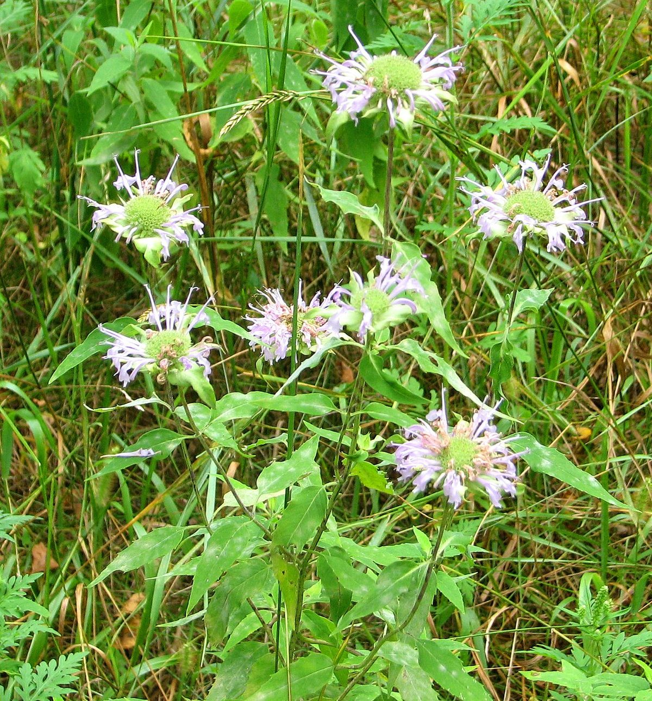

# Wild Bergamot

*Monarda fistulosa*

Monarda fistulosa, the wild bergamot or bee balm, is a wildflower in the mint family Lamiaceae, widespread and abundant as a native plant in much of North America. This plant, with showy summer-blooming pink to lavender flowers, is often used as a honey plant, medicinal plant, and garden ornamental.  The species is quite variable, and several subspecies or varieties have been recognized within it.

## Quick Facts

| | |
|---|---|
| **Scientific name** | *Monarda fistulosa* |
| **Family** | — |
| **Height** | — |
| **Bloom time** | — |
| **Sun** | — |
| **Moisture** | — |
| **Soil** | — |
| **Wildlife value** | — |

## Mentioned In

- [Prairie Plants Grasslands](../chapters/03-prairie-plants-grasslands/index.md)
- [Pollinators Wildlife](../chapters/06-pollinators-wildlife/index.md)
- [Garden Design Native Plants](../chapters/10-garden-design-native-plants/index.md)
- [Planting Maintenance Sourcing](../chapters/11-planting-maintenance-sourcing/index.md)

## Image Credits

- Eric Hunt (CC BY-SA 4.0)
- D. Gordon E. Robertson (CC BY-SA 3.0)

## Learn More

- [Wikipedia: Monarda fistulosa](https://en.wikipedia.org/wiki/Monarda_fistulosa)
