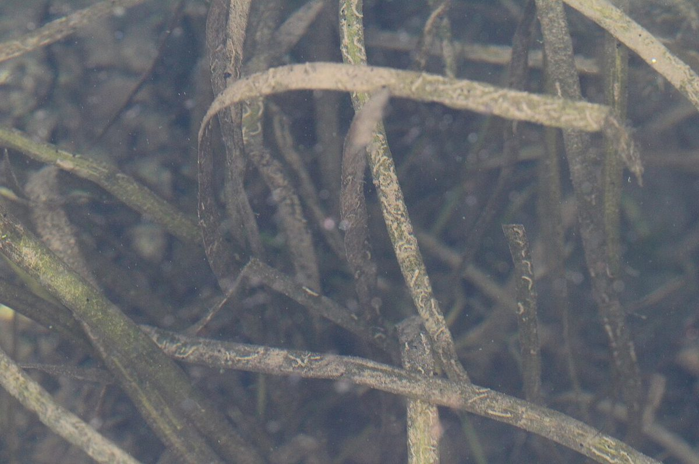

# Wild Celery

*Vallisneria americana*

Vallisneria americana, commonly called wild celery, water-celery, tape grass, or  eelgrass,  is a plant in the family Hydrocharitaceae, the "tape-grasses". It is native to the Americas, especially eastern North America.
V. americana is a fresh water species that can tolerate salt, living in salinities varying from fresh water (0 parts per thousand) to 18 parts per thousand, although the limit to the salt tolerance is unclear and is generally dependent on the duration and intensity of the plants' exposure to the saline water.

## Quick Facts

| | |
|---|---|
| **Scientific name** | *Vallisneria americana* |
| **Family** | — |
| **Height** | — |
| **Bloom time** | — |
| **Sun** | — |
| **Moisture** | — |
| **Soil** | — |
| **Wildlife value** | — |

## Mentioned In

- [Wetland Shoreline Plants](../chapters/05-wetland-shoreline-plants/index.md)

## Image Credits

- Samuel A Schmid (CC BY 4.0)

## Learn More

- [Wikipedia: Vallisneria americana](https://en.wikipedia.org/wiki/Vallisneria_americana)
