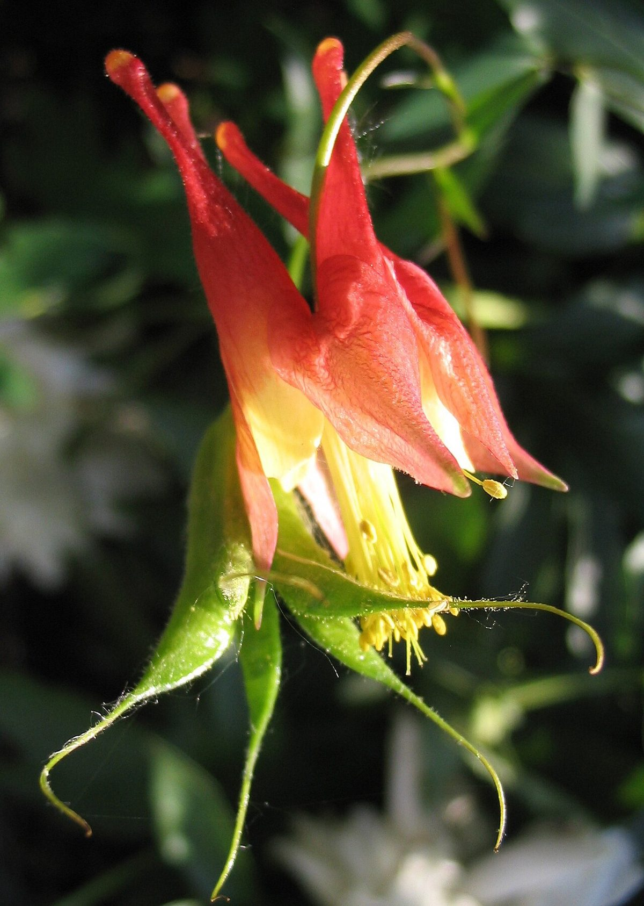

# Wild Columbine

*Aquilegia canadensis*

Aquilegia canadensis, the Canadian columbine, Canada columbine, eastern red columbine, or wild columbine, is a species of flowering plant in the buttercup family. It is a perennial plant that is native to the woodlands and rocky areas in eastern North America in both the United States and southern Canada. It readily hybridizes with other plants in the columbine genus and is a common garden plant.

## Quick Facts

| | |
|---|---|
| **Scientific name** | *Aquilegia canadensis* |
| **Family** | — |
| **Height** | — |
| **Bloom time** | — |
| **Sun** | — |
| **Moisture** | — |
| **Soil** | — |
| **Wildlife value** | — |

## Mentioned In

- [Pollinators Wildlife](../chapters/06-pollinators-wildlife/index.md)
- [Garden Design Native Plants](../chapters/10-garden-design-native-plants/index.md)

## Image Credits

- KENPEI (CC BY-SA 3.0)
- ṜέđṃάяķvюĨїήīṣŢ Drop me a lineReview Me! (CC BY-SA 3.0)

## Learn More

- [Wikipedia: Aquilegia canadensis](https://en.wikipedia.org/wiki/Aquilegia_canadensis)
