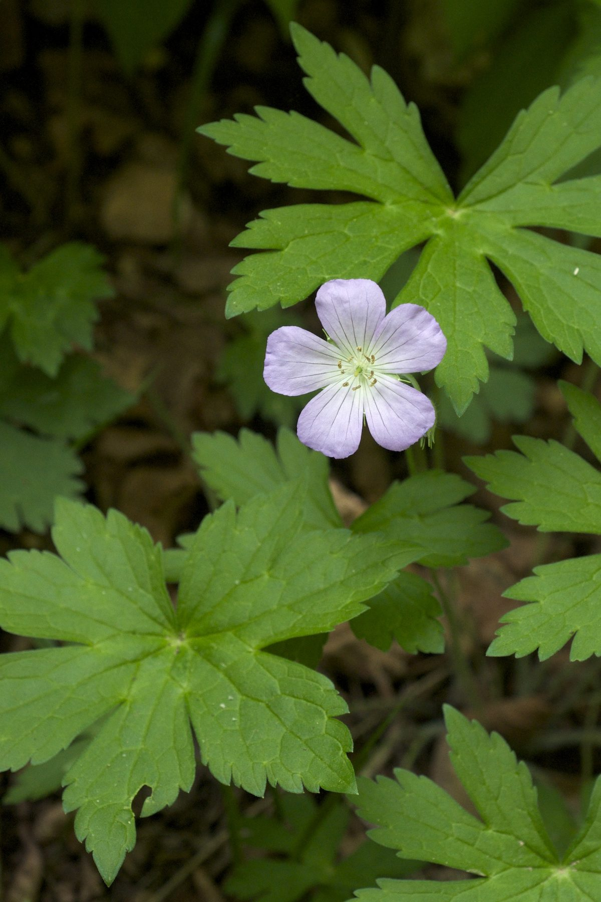

# Wild Geranium

*Geranium maculatum*

Geranium maculatum, the wild geranium, spotted geranium, or wood geranium, is a perennial plant native to woodlands in eastern North America, from southern Manitoba and southwestern Quebec south to Alabama and Georgia and west to Oklahoma and South Dakota.

## Quick Facts

| | |
|---|---|
| **Scientific name** | *Geranium maculatum* |
| **Family** | — |
| **Height** | — |
| **Bloom time** | — |
| **Sun** | — |
| **Moisture** | — |
| **Soil** | — |
| **Wildlife value** | — |

## Mentioned In

- [Woodland Forest Plants](../chapters/04-woodland-forest-plants/index.md)
- [Ecological Restoration](../chapters/12-ecological-restoration/index.md)

## Image Credits

- Hardyplants at English Wikipedia (Public domain)
- Eric in SF (CC BY-SA 3.0)

## Learn More

- [Wikipedia: Geranium maculatum](https://en.wikipedia.org/wiki/Geranium_maculatum)
