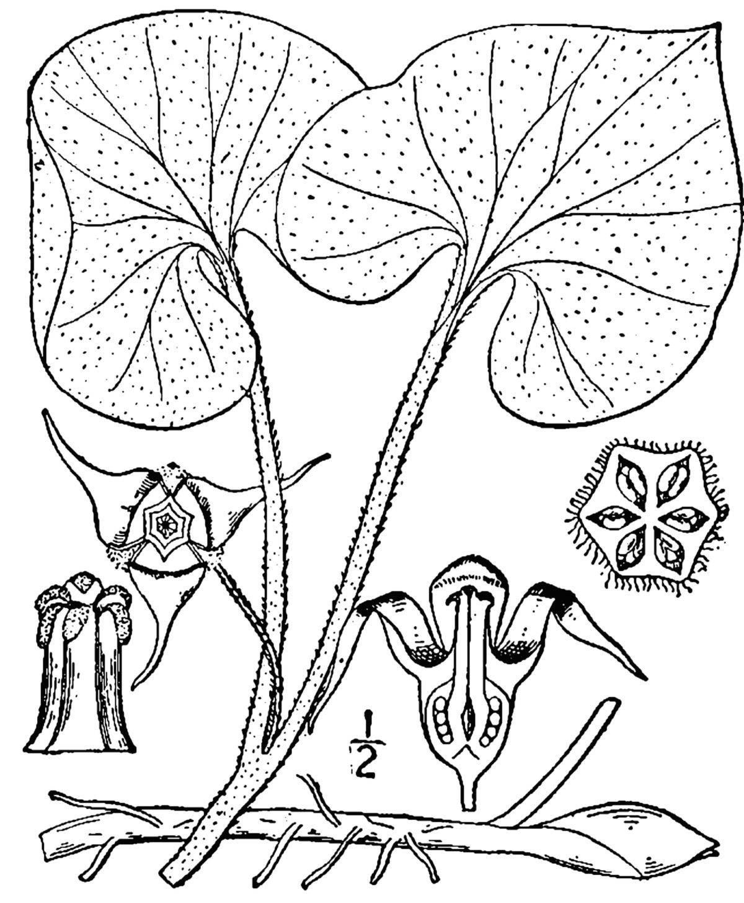

# Wild Ginger

*Asarum canadense*

Asarum canadense, commonly known as Canada wild ginger, Canadian snakeroot, Indian Ginger, Coltsfoot, and Broad-Leaved Asarabacca, is a herbaceous, perennial plant. It should not be confused for Asarum reflexum, a closely related species, or Asarum acuminatum, a variety of A. canadense.
It forms dense colonies in the understory of deciduous forests throughout its native range in eastern North America.

## Quick Facts

| | |
|---|---|
| **Scientific name** | *Asarum canadense* |
| **Family** | — |
| **Height** | — |
| **Bloom time** | — |
| **Sun** | — |
| **Moisture** | — |
| **Soil** | — |
| **Wildlife value** | — |

## Mentioned In

- [Woodland Forest Plants](../chapters/04-woodland-forest-plants/index.md)
- [Pollinators Wildlife](../chapters/06-pollinators-wildlife/index.md)

## Image Credits

- Unknown (Public domain)
- Britton, N.L., and A. Brown (Public domain)

## Learn More

- [Wikipedia: Asarum canadense](https://en.wikipedia.org/wiki/Asarum_canadense)
