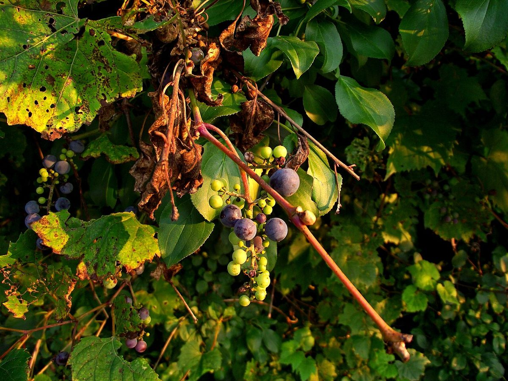

# Wild Grape

*Vitis riparia*

Vitis riparia Michx, with common names riverbank grape or frost grape, is a vine indigenous to North America. As a climbing or trailing vine, it is widely distributed across central and eastern Canada and the central and northeastern parts of the United States, from Quebec to Texas, and eastern Montana to Nova Scotia. There are reports of isolated populations in the northwestern USA, but these are probably naturalized.

## Quick Facts

| | |
|---|---|
| **Scientific name** | *Vitis riparia* |
| **Family** | — |
| **Height** | — |
| **Bloom time** | — |
| **Sun** | — |
| **Moisture** | — |
| **Soil** | — |
| **Wildlife value** | — |

## Mentioned In

- [Woodland Forest Plants](../chapters/04-woodland-forest-plants/index.md)
- [Plant Identification Skills](../chapters/07-plant-identification-skills/index.md)
- [Cultural Indigenous Uses](../chapters/13-cultural-indigenous-uses/index.md)

## Image Credits

- Wasrts (CC BY-SA 3.0)
- Wasrts (CC BY-SA 3.0)

## Learn More

- [Wikipedia: Vitis riparia](https://en.wikipedia.org/wiki/Vitis_riparia)
