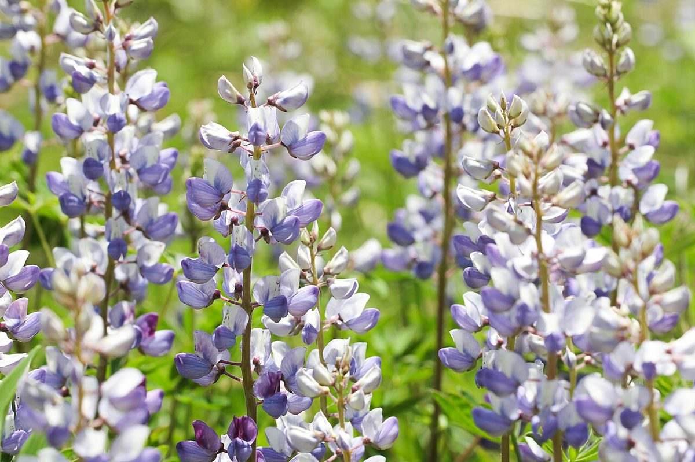
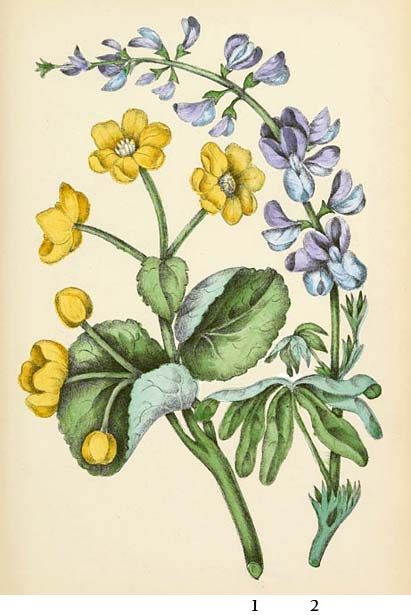

# Wild Lupine

*Lupinus perennis*

Lupinus perennis (also wild perennial lupine, wild lupine, sundial lupine, blue lupine, Indian beet, or old maid's bonnets) is a flowering plant in the family Fabaceae.

## Quick Facts

| | |
|---|---|
| **Scientific name** | *Lupinus perennis* |
| **Family** | — |
| **Height** | — |
| **Bloom time** | — |
| **Sun** | — |
| **Moisture** | — |
| **Soil** | — |
| **Wildlife value** | — |

## Mentioned In

- [Pollinators Wildlife](../chapters/06-pollinators-wildlife/index.md)

## Image Credits

- cassi saari (CC BY-SA 4.0)
- MRS. C. P. TRAILL (Public domain)

## Learn More

- [Wikipedia: Lupinus perennis](https://en.wikipedia.org/wiki/Lupinus_perennis)
