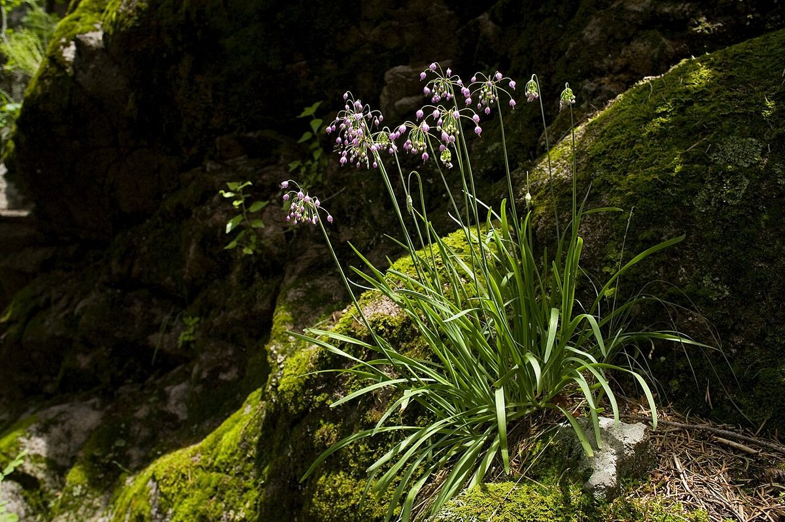

# Wild Onion

*Allium cernuum*

Allium cernuum, known as nodding onion or lady's leek, is a perennial plant in the genus Allium. It grows in open areas in North America.

## Quick Facts

| | |
|---|---|
| **Scientific name** | *Allium cernuum* |
| **Family** | — |
| **Height** | — |
| **Bloom time** | — |
| **Sun** | — |
| **Moisture** | — |
| **Soil** | — |
| **Wildlife value** | — |

## Mentioned In

- [Cultural Indigenous Uses](../chapters/13-cultural-indigenous-uses/index.md)

## Image Credits

- Matt Lavin from Bozeman, Montana, USA (CC BY-SA 2.0)
- Patrick Alexander from Las Cruces, NM (CC0)

## Learn More

- [Wikipedia: Allium cernuum](https://en.wikipedia.org/wiki/Allium_cernuum)
