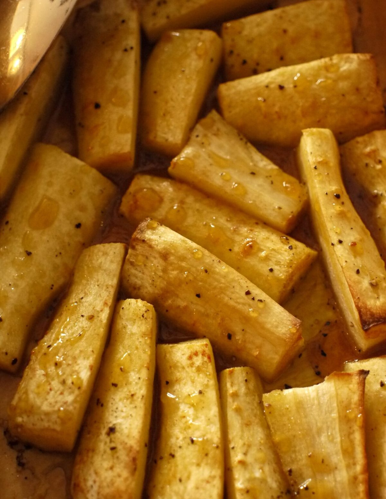

# Wild Parsnip

*Pastinaca sativa*

The parsnip (Pastinaca sativa) is a root vegetable closely related to carrot and parsley, all belonging to the flowering plant family Apiaceae. It is a biennial plant usually grown as an annual. Its long taproot has light cream colored skin and flesh, and, left in the ground to mature, becomes sweeter in flavor after winter frosts.

## Quick Facts

| | |
|---|---|
| **Scientific name** | *Pastinaca sativa* |
| **Family** | — |
| **Height** | — |
| **Bloom time** | — |
| **Sun** | — |
| **Moisture** | — |
| **Soil** | — |
| **Wildlife value** | — |

## Mentioned In

- [Plant Identification Skills](../chapters/07-plant-identification-skills/index.md)
- [Invasive Species Id](../chapters/08-invasive-species-id/index.md)

## Image Credits

- Skogkatten (CC BY-SA 4.0)
- Unknown (Unknown)

## Learn More

- [Wikipedia: Parsnip](https://en.wikipedia.org/wiki/Parsnip)
