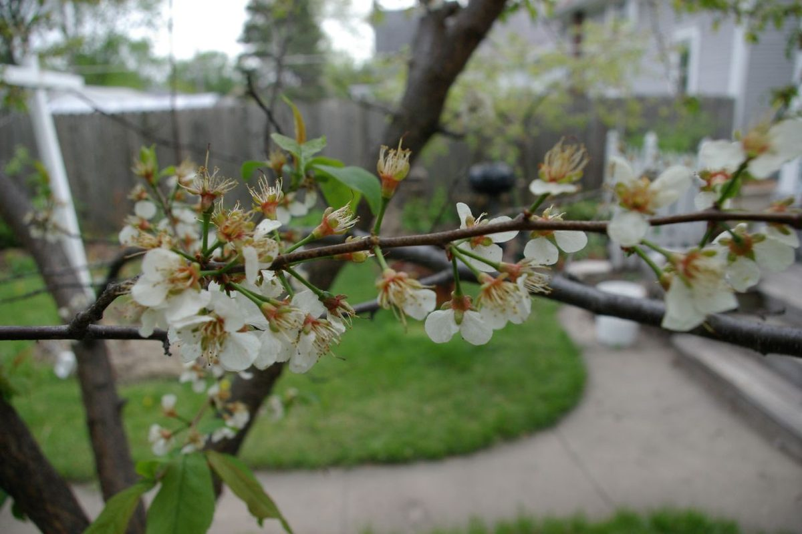

# Wild Plum

*Prunus americana*

Prunus americana, commonly called the American plum, wild plum, or Marshall's large yellow sweet plum, is a species of Prunus native to North America from Saskatchewan and Idaho south to New Mexico and east to Québec, Maine and Florida.
Prunus americana has often been planted outside its native range and sometimes escapes cultivation. It is commonly confused with the Canada plum (Prunus nigra), although the fruit is smaller and rounder and bright red as opposed to yellow.

## Quick Facts

| | |
|---|---|
| **Scientific name** | *Prunus americana* |
| **Family** | — |
| **Height** | — |
| **Bloom time** | — |
| **Sun** | — |
| **Moisture** | — |
| **Soil** | — |
| **Wildlife value** | — |

## Mentioned In

- [Pollinators Wildlife](../chapters/06-pollinators-wildlife/index.md)
- [Cultural Indigenous Uses](../chapters/13-cultural-indigenous-uses/index.md)

## Image Credits

- USDA-NRCS PLANTS Database / Herman, D.E., et al. 1996. North Dakota tree handbook. USDA NRCS ND State Soil Conservation Committee; NDSU Extension and Western Area Power Administration, Bismarck. (Public domain)
- Andrew Ciscel (CC BY-SA 2.0)

## Learn More

- [Wikipedia: Prunus americana](https://en.wikipedia.org/wiki/Prunus_americana)
