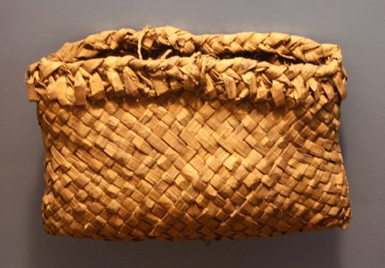
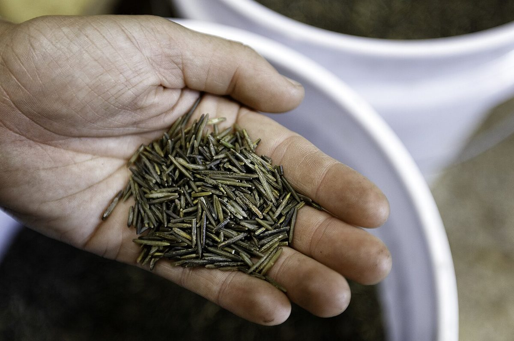

# Wild Rice

*Zizania palustris*

Wild rice, also called manoomin, mnomen, psíŋ, Canada rice, Indian rice, or water oats, is any of four species of grasses that form the genus Zizania, and the grain that can be harvested from them. The grain was historically and is still gathered and eaten in North America and, to a lesser extent, China, where the plant's stem is used as a vegetable.
Wild rice and domesticated rice (Oryza sativa and Oryza glaberrima), are in the same botanical tribe Oryzeae.

## Quick Facts

| | |
|---|---|
| **Scientific name** | *Zizania palustris* |
| **Family** | — |
| **Height** | — |
| **Bloom time** | — |
| **Sun** | — |
| **Moisture** | — |
| **Soil** | — |
| **Wildlife value** | — |

## Mentioned In

- [Wetland Shoreline Plants](../chapters/05-wetland-shoreline-plants/index.md)

## Image Credits

- Uyvsdi (Public domain)
- Lorie Shaull from St Paul, United States (CC BY 2.0)

## Learn More

- [Wikipedia: Wild rice](https://en.wikipedia.org/wiki/Wild_rice)
