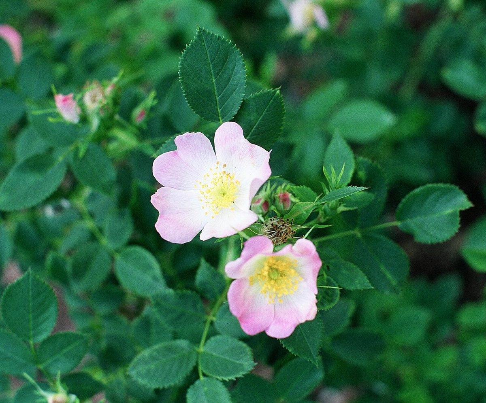

# Wild Rose

*Rosa blanda*

Rosa blanda, commonly known as the smooth rose, meadow/wild rose, or prairie rose, is a species of rose native to North America. Among roses, it is closest to a "thornless" rose, with just a few thorns at the base. The meadow rose occurs as a colony-forming shrub growing to 1 m (3.3 ft) high, naturally in prairies and meadows.

## Quick Facts

| | |
|---|---|
| **Scientific name** | *Rosa blanda* |
| **Family** | — |
| **Height** | — |
| **Bloom time** | — |
| **Sun** | — |
| **Moisture** | — |
| **Soil** | — |
| **Wildlife value** | — |

## Mentioned In

- [Pollinators Wildlife](../chapters/06-pollinators-wildlife/index.md)

## Image Credits

- A. Barra (CC BY-SA 3.0)

## Learn More

- [Wikipedia: Rosa blanda](https://en.wikipedia.org/wiki/Rosa_blanda)
