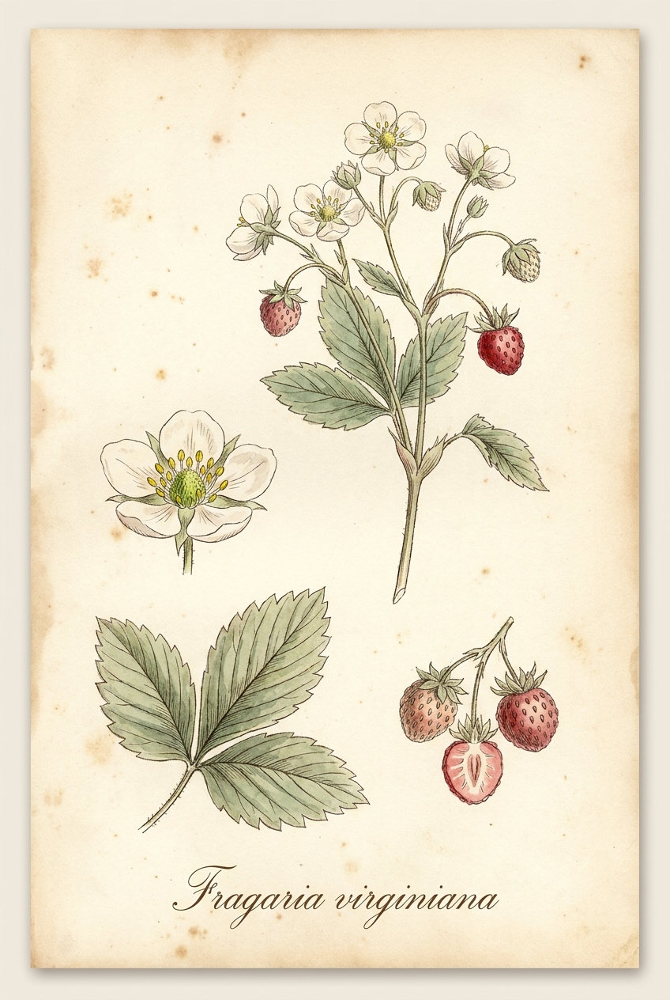
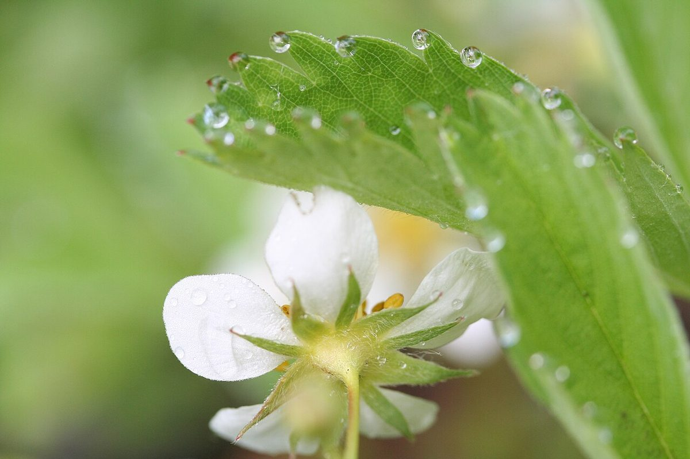

# Wild Strawberry

*Fragaria virginiana*

{ .plant-illustration }

*Botanical plate of* **Fragaria virginiana** *— Curtis-style illustration.*

Fragaria virginiana, known as Virginia strawberry, wild strawberry, common strawberry, or mountain strawberry, is a perennial North American strawberry that grows across much of the United States and southern Canada. It is one of the two species of wild strawberry that were hybridized to create the modern domesticated garden strawberry (Fragaria × ananassa).

## Quick Facts

| | |
|---|---|
| **Scientific name** | *Fragaria virginiana* |
| **Family** | — |
| **Height** | — |
| **Bloom time** | — |
| **Sun** | — |
| **Moisture** | — |
| **Soil** | — |
| **Wildlife value** | — |

## Mentioned In

- [Pollinators Wildlife](../chapters/06-pollinators-wildlife/index.md)
- [Garden Design Native Plants](../chapters/10-garden-design-native-plants/index.md)

## Image Credits

- Shipher Wu (photograph) and Gee-way Lin (aphid provision), National Taiwan University (CC BY 2.5)
- Nichole Ouellette/ouellette001.com (CC BY-SA 4.0)

## Learn More

- [Wikipedia: Fragaria virginiana](https://en.wikipedia.org/wiki/Fragaria_virginiana)
