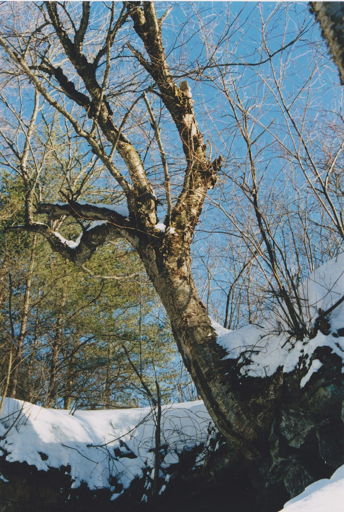

# Yellow Birch

*Betula alleghaniensis*

Betula alleghaniensis, the yellow birch, golden birch, or swamp birch, is a large species of birch native to northeastern North America. Its vernacular names refer to the golden color of the tree's bark. In the past its scientific name was Betula lutea, the yellow birch.

## Quick Facts

| | |
|---|---|
| **Scientific name** | *Betula alleghaniensis* |
| **Family** | — |
| **Height** | — |
| **Bloom time** | — |
| **Sun** | — |
| **Moisture** | — |
| **Soil** | — |
| **Wildlife value** | — |

## Mentioned In

- [Woodland Forest Plants](../chapters/04-woodland-forest-plants/index.md)

## Image Credits

- Joseph OBrien (CC BY 3.0)
- Nichole Ouellette/ouellette001.com (CC BY 4.0)

## Learn More

- [Wikipedia: Betula alleghaniensis](https://en.wikipedia.org/wiki/Betula_alleghaniensis)
