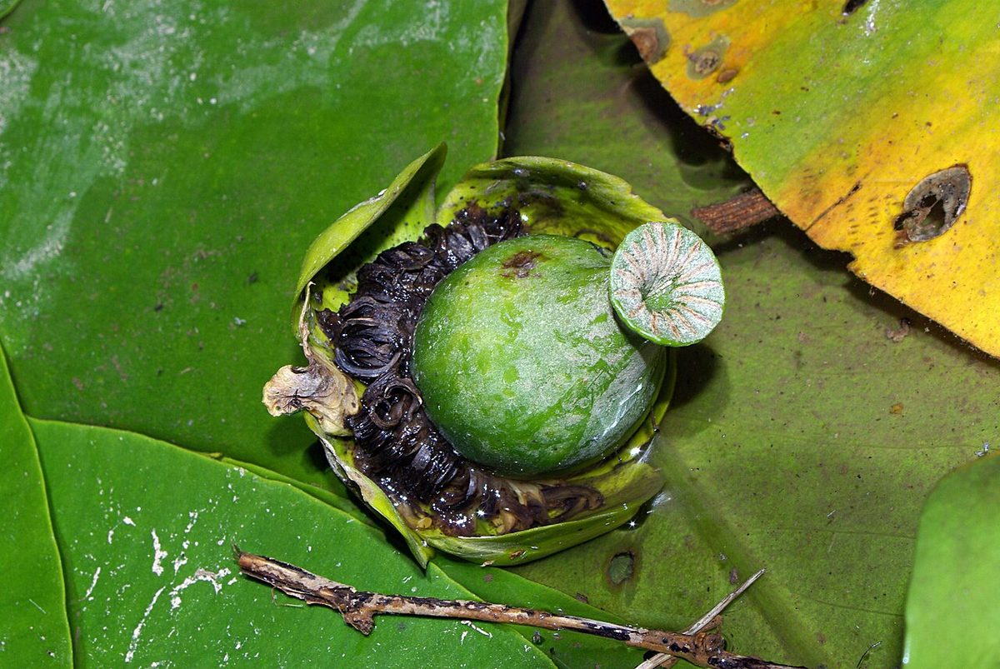

# Yellow Pond Lily

*Nuphar variegata*

Nuphar is a genus of aquatic plants in the family Nymphaeaceae, with a temperate to subarctic Northern Hemisphere distribution. Common names include water-lily (Eurasian species; shared with many other genera in the same family), pond-lily, alligator-bonnet or bonnet lily, and spatterdock (North American species).

## Quick Facts

| | |
|---|---|
| **Scientific name** | *Nuphar variegata* |
| **Family** | — |
| **Height** | — |
| **Bloom time** | — |
| **Sun** | — |
| **Moisture** | — |
| **Soil** | — |
| **Wildlife value** | — |

## Mentioned In

- [Wetland Shoreline Plants](../chapters/05-wetland-shoreline-plants/index.md)

## Image Credits

- Kevmin (CC BY-SA 4.0)
- David Perez (CC BY 3.0)

## Learn More

- [Wikipedia: Nuphar](https://en.wikipedia.org/wiki/Nuphar)
