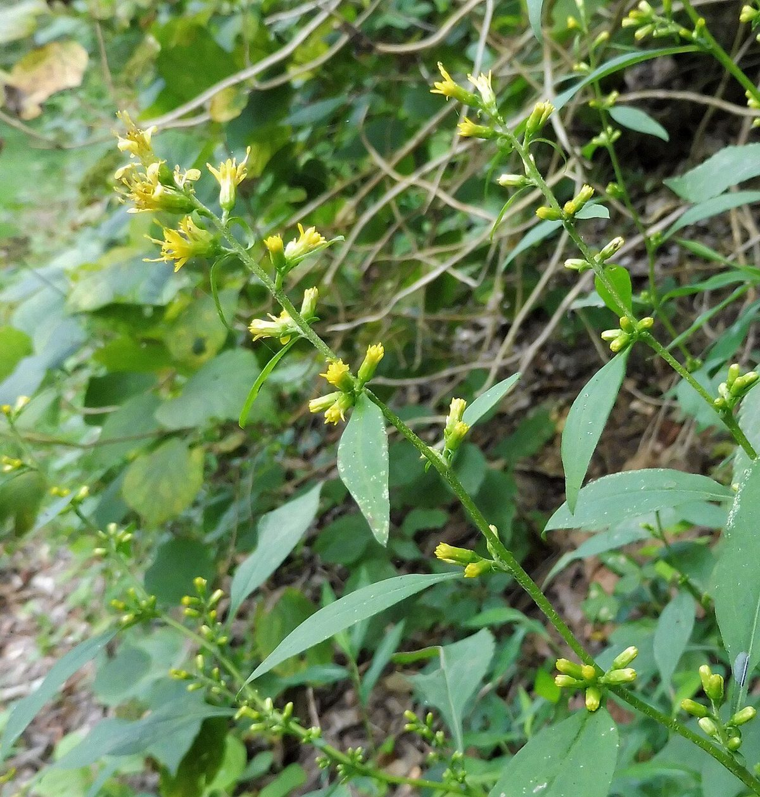

# Zigzag Goldenrod

*Solidago flexicaulis*

Solidago flexicaulis, the broadleaved goldenrod, or zigzag goldenrod, is a North American species of herbaceous perennial plants in the family Asteraceae. It is native to the eastern and central parts of the United States and Canada, from Nova Scotia west to Ontario and the Dakotas, and south as far as Alabama and Louisiana. It grows in a variety of habitats including mesic upland forests, well drained floodplain forests, seepage swamp hummocks, and rocky woodlands.

## Quick Facts

| | |
|---|---|
| **Scientific name** | *Solidago flexicaulis* |
| **Family** | — |
| **Height** | — |
| **Bloom time** | — |
| **Sun** | — |
| **Moisture** | — |
| **Soil** | — |
| **Wildlife value** | — |

## Mentioned In

- [Woodland Forest Plants](../chapters/04-woodland-forest-plants/index.md)
- [Ecological Restoration](../chapters/12-ecological-restoration/index.md)

## Image Credits

- New York Botanical Garden. (Public domain)
- Mason Brock (Masebrock) (Public domain)

## Learn More

- [Wikipedia: Solidago flexicaulis](https://en.wikipedia.org/wiki/Solidago_flexicaulis)
