# MicroSims

A MicroSim is a small interactive simulation built around a single idea. Each
one lives at `docs/sims/<name>/` and is embedded in the chapter it belongs to,
but every sim also works on its own — click any card below to open it full
size.

All 22 are implemented and live. Twenty-one are embedded in a chapter; the
Learning Graph Viewer stands alone as a map of the whole book.

## Catalog

<div class="sim-gallery-grid" markdown>

<a href="native-vs-invasive-sorter/index.md" class="sim-card">
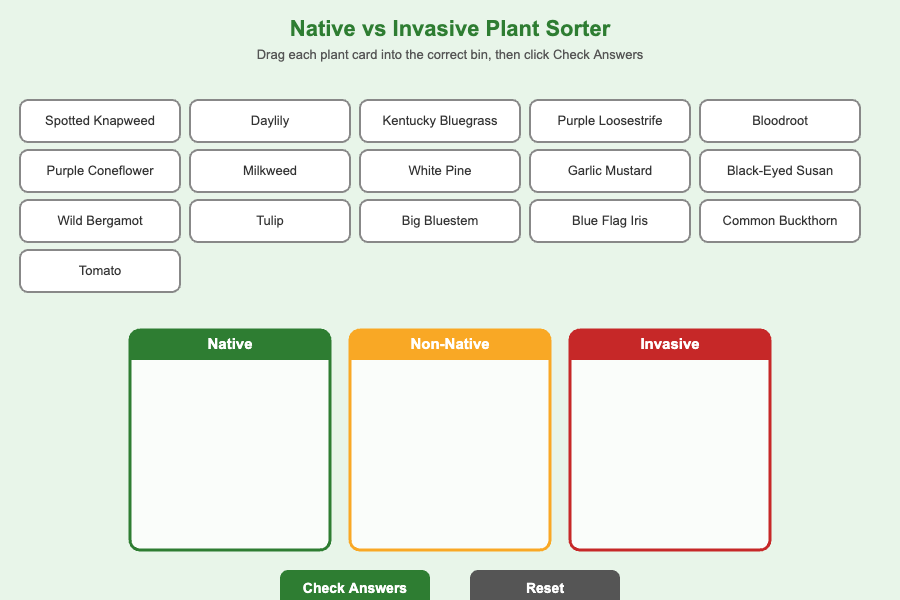
<div class="sim-card-body"><strong>Native vs Invasive Sorter</strong>
Drag Minnesota species into three bins — native, non-native, invasive — then check your answers. Practice for the decision tree in Chapter 1.
<span class="sim-card-chapter">Chapter 1</span></div>
</a>

<a href="mn-ecoregion-explorer/index.md" class="sim-card">
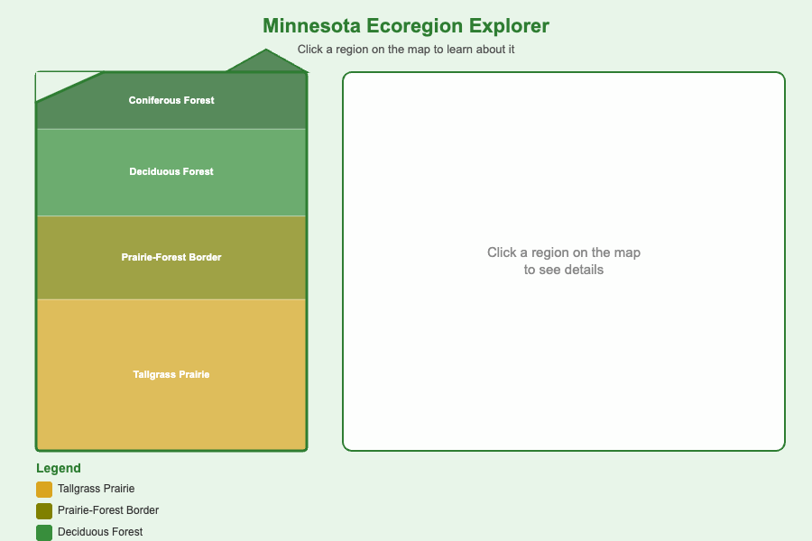
<div class="sim-card-body"><strong>Minnesota Ecoregion Explorer</strong>
Click any region of the state to see its climate, soils, and characteristic plant community, from tallgrass prairie to boreal forest.
<span class="sim-card-chapter">Chapter 2</span></div>
</a>

<a href="hardiness-zone-lookup/index.md" class="sim-card">
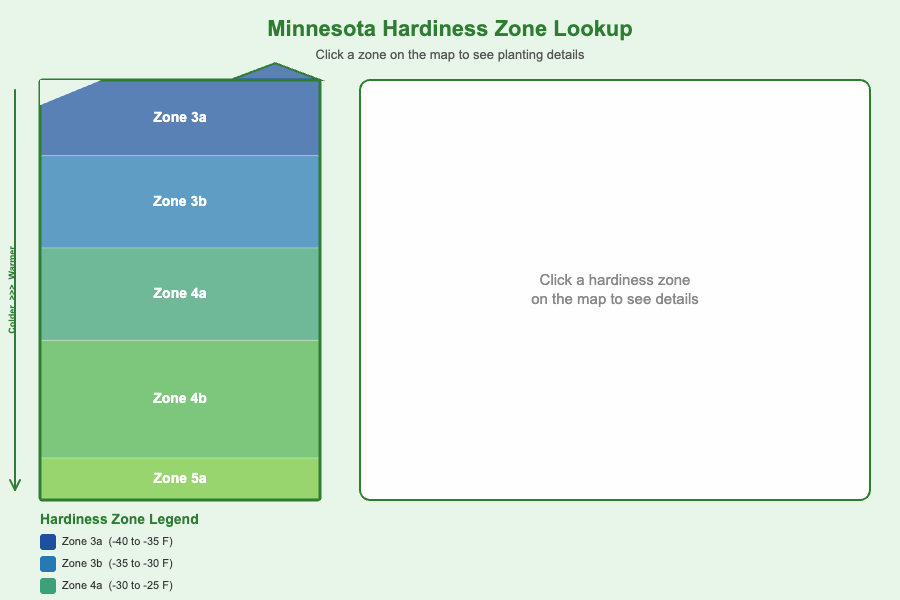
<div class="sim-card-body"><strong>Hardiness Zone Lookup</strong>
Click your part of Minnesota to find your USDA zone, from 3a in the far north to 5a in the southeast, and what that means for plant choice.
<span class="sim-card-chapter">Chapter 2</span></div>
</a>

<a href="prairie-root-depth/index.md" class="sim-card">
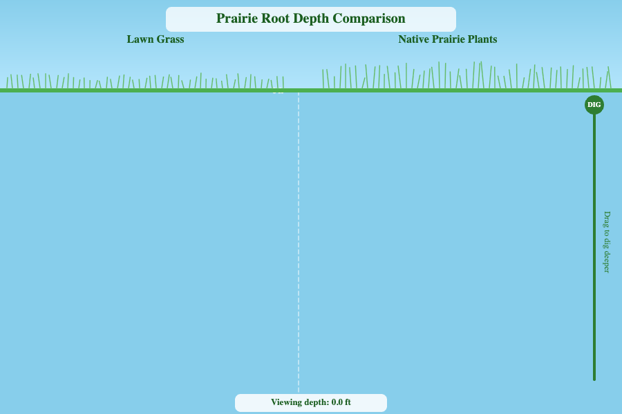
<div class="sim-card-body"><strong>Prairie Root Depth Comparison</strong>
Drag the depth slider to compare lawn grass roots against native prairie roots. The single most persuasive image in the book.
<span class="sim-card-chapter">Chapter 3</span></div>
</a>

<a href="fire-ecology-sim/index.md" class="sim-card">
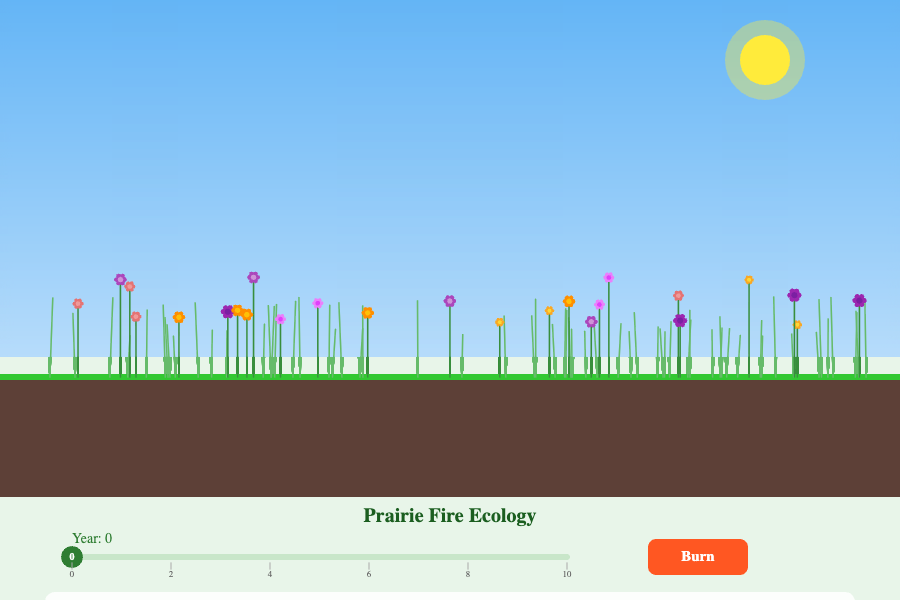
<div class="sim-card-body"><strong>Prairie Fire Ecology Simulator</strong>
Burn a prairie and watch what happens over the following years. Shows why fire builds prairie rather than destroying it.
<span class="sim-card-chapter">Chapter 3</span></div>
</a>

<a href="forest-layers-explorer/index.md" class="sim-card">
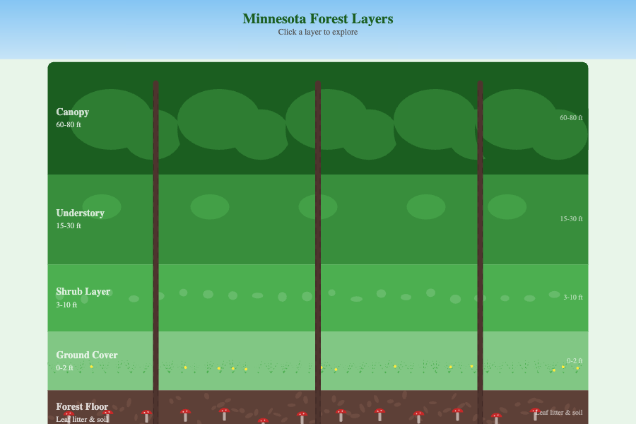
<div class="sim-card-body"><strong>Minnesota Forest Layers</strong>
Click through canopy, understory, shrub layer, and ground cover to see which species occupy each level and how much light reaches it.
<span class="sim-card-chapter">Chapter 4</span></div>
</a>

<a href="rain-garden-designer/index.md" class="sim-card">
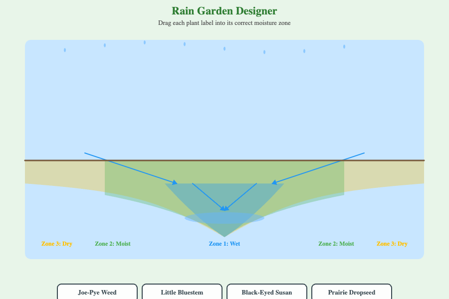
<div class="sim-card-body"><strong>Rain Garden Designer</strong>
Drag plants into the right moisture zone of a rain garden cross-section — basin, slope, or upland edge.
<span class="sim-card-chapter">Chapters 5, 10</span></div>
</a>

<a href="pollinator-match/index.md" class="sim-card">
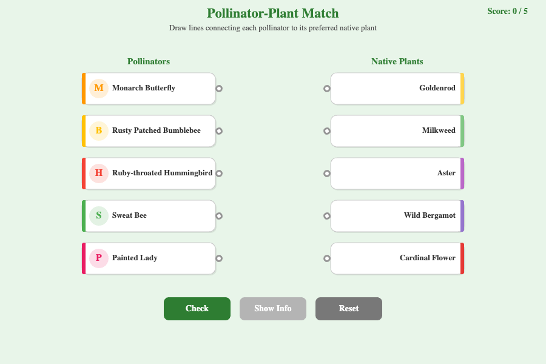
<div class="sim-card-body"><strong>Pollinator-Plant Match</strong>
Draw lines connecting each pollinator to the native plant it depends on. Specialist relationships are stricter than most people expect.
<span class="sim-card-chapter">Chapter 6</span></div>
</a>

<a href="bloom-calendar/index.md" class="sim-card">
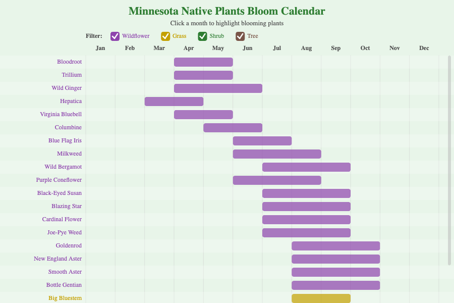
<div class="sim-card-body"><strong>Bloom Calendar</strong>
A month-by-month bloom chart for Minnesota natives. Highlight any month to find the gaps in your own planting.
<span class="sim-card-chapter">Chapters 6, 10</span></div>
</a>

<a href="leaf-shape-identifier/index.md" class="sim-card">
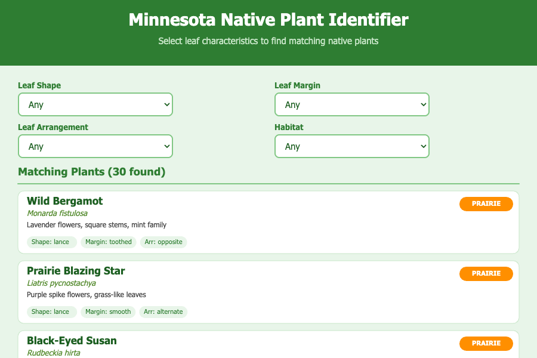
<div class="sim-card-body"><strong>Native Plant Identifier</strong>
Pick leaf shape, margin, arrangement and habitat, and narrow 30 native species down to the ones that match.
<span class="sim-card-chapter">Chapter 7</span></div>
</a>

<a href="invasive-species-flashcards/index.md" class="sim-card">
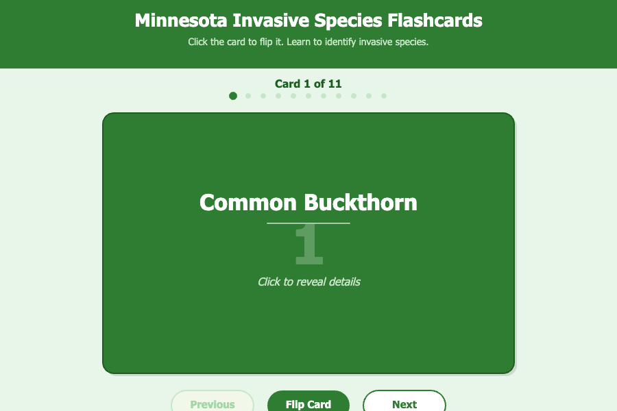
<div class="sim-card-body"><strong>Invasive Species Flashcards</strong>
Eleven cards covering Minnesota's worst invaders. Flip each one for the field marks that separate it from look-alikes.
<span class="sim-card-chapter">Chapter 8</span></div>
</a>

<a href="removal-strategy-selector/index.md" class="sim-card">
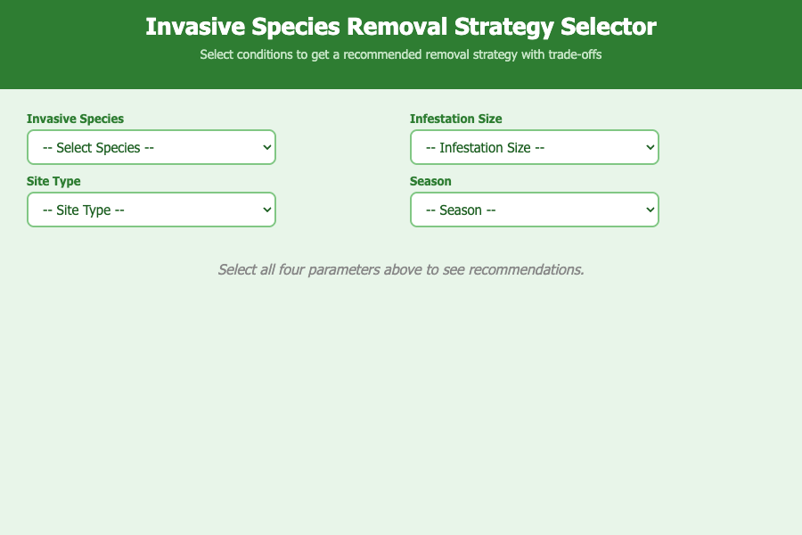
<div class="sim-card-body"><strong>Removal Strategy Selector</strong>
Choose species, infestation size, site type and season to get a removal method with its real trade-offs.
<span class="sim-card-chapter">Chapter 9</span></div>
</a>

<a href="site-assessment-tool/index.md" class="sim-card">
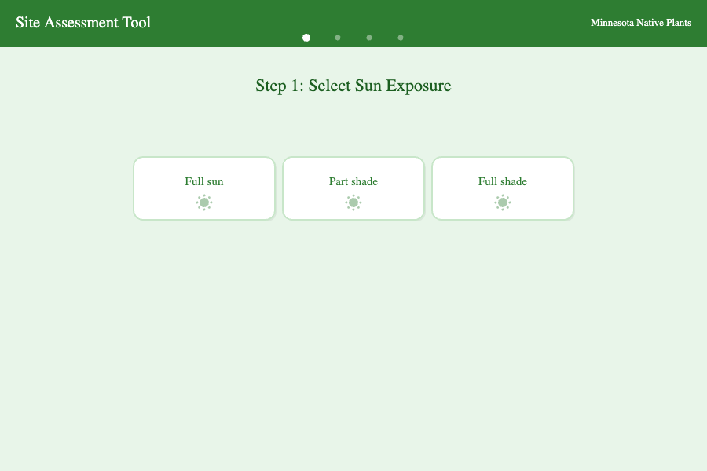
<div class="sim-card-body"><strong>Site Assessment Tool</strong>
Walk through sun, moisture, and soil for your own yard, and get a plant list that fits what you actually have.
<span class="sim-card-chapter">Chapter 10</span></div>
</a>

<a href="garden-design-planner/index.md" class="sim-card">
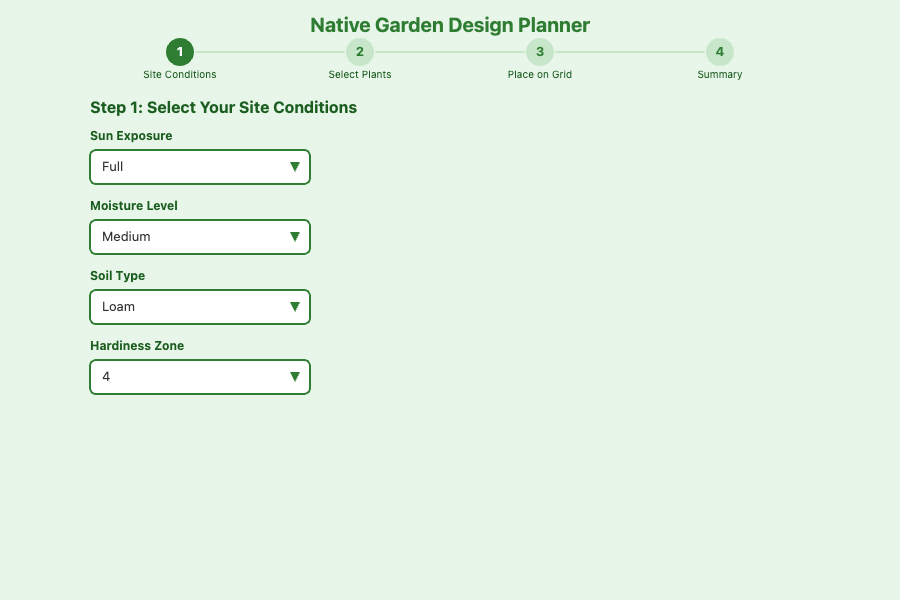
<div class="sim-card-body"><strong>Native Garden Design Planner</strong>
A four-step planner: site conditions, plant selection, placement, then a summary you can work from.
<span class="sim-card-chapter">Chapters 10, 17</span></div>
</a>

<a href="garden-layout-planner/index.md" class="sim-card">
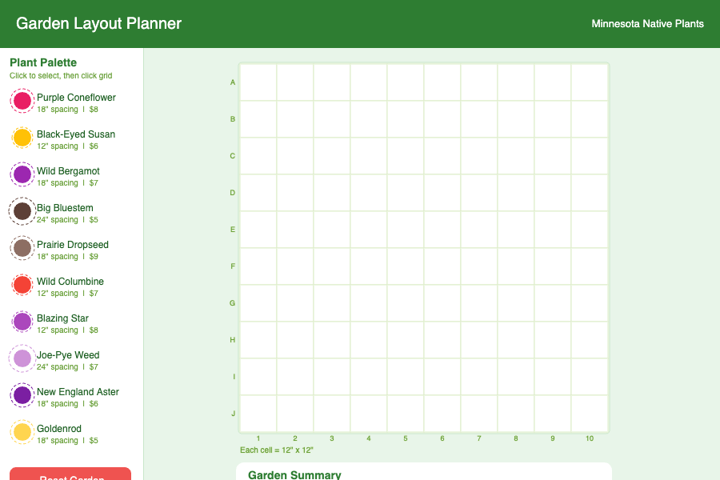
<div class="sim-card-body"><strong>Garden Layout Planner</strong>
Place plants on a scaled grid at their correct mature spacing and see how the bed fills in.
<span class="sim-card-chapter">Chapter 10</span></div>
</a>

<a href="planting-calendar/index.md" class="sim-card">
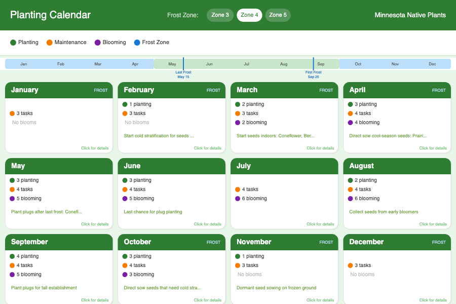
<div class="sim-card-body"><strong>Planting Calendar</strong>
What to do each month in a Minnesota native garden — planting, maintenance, blooming, and frost dates by zone.
<span class="sim-card-chapter">Chapter 11</span></div>
</a>

<a href="restoration-timeline-sim/index.md" class="sim-card">
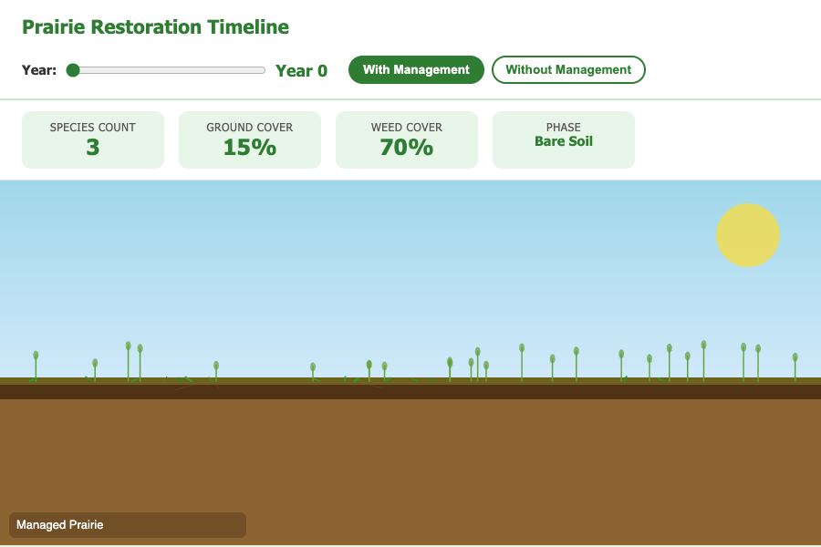
<div class="sim-card-body"><strong>Prairie Restoration Timeline</strong>
Run a restoration year by year, with and without management, and watch species count, ground cover and weed pressure change.
<span class="sim-card-chapter">Chapter 12</span></div>
</a>

<a href="ethnobotany-explorer/index.md" class="sim-card">
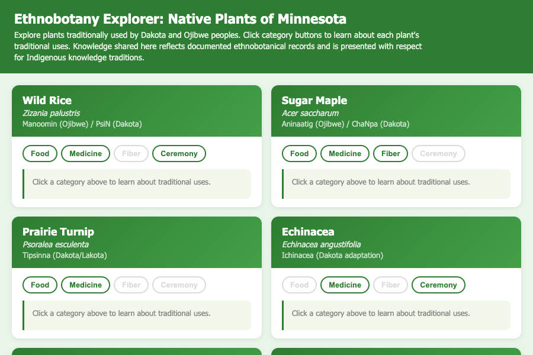
<div class="sim-card-body"><strong>Ethnobotany Explorer</strong>
Plants traditionally used by Dakota and Ojibwe peoples, organised by food, medicine, fiber and ceremony, from documented sources.
<span class="sim-card-chapter">Chapter 13</span></div>
</a>

<a href="mn-resource-finder/index.md" class="sim-card">
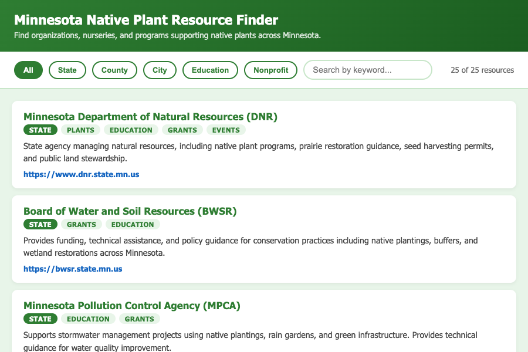
<div class="sim-card-body"><strong>Native Plant Resource Finder</strong>
Twenty-five Minnesota organizations, nurseries and programs, filterable by type and searchable by keyword.
<span class="sim-card-chapter">Chapter 14</span></div>
</a>

<a href="feedback-loop-explorer/index.md" class="sim-card">
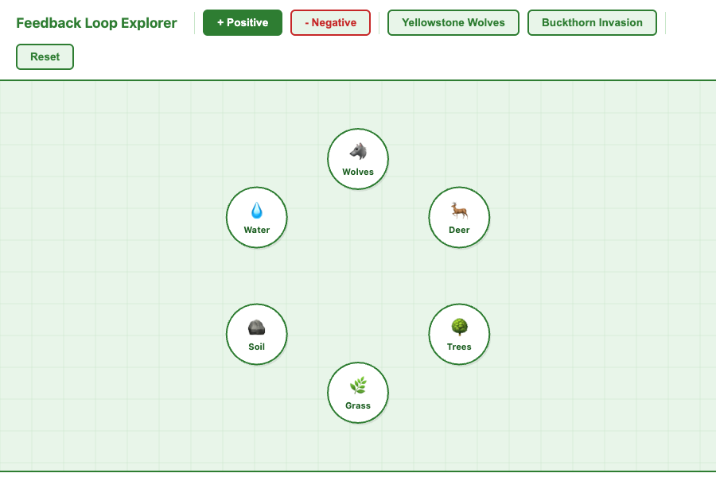
<div class="sim-card-body"><strong>Feedback Loop Explorer</strong>
Trace reinforcing and balancing loops through real cases — Yellowstone wolves, buckthorn invasion — as a systems diagram.
<span class="sim-card-chapter">Chapter 15</span></div>
</a>

<a href="source-credibility-evaluator/index.md" class="sim-card">
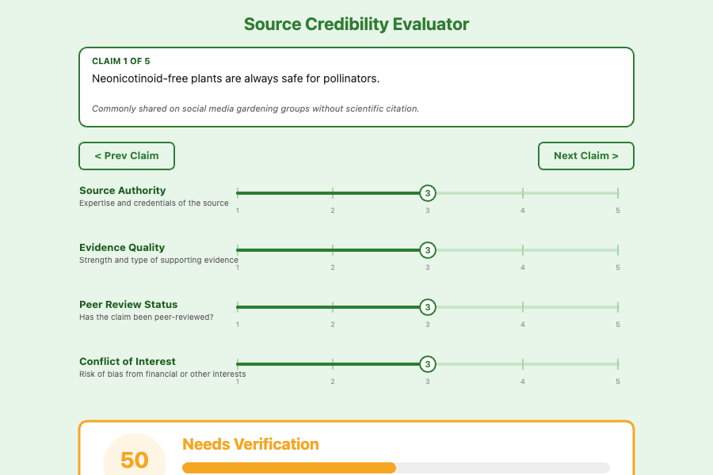
<div class="sim-card-body"><strong>Source Credibility Evaluator</strong>
Score five real plant claims on authority, evidence, peer review and conflict of interest, then see how your score compares.
<span class="sim-card-chapter">Chapter 16</span></div>
</a>

<a href="graph-viewer/index.md" class="sim-card">
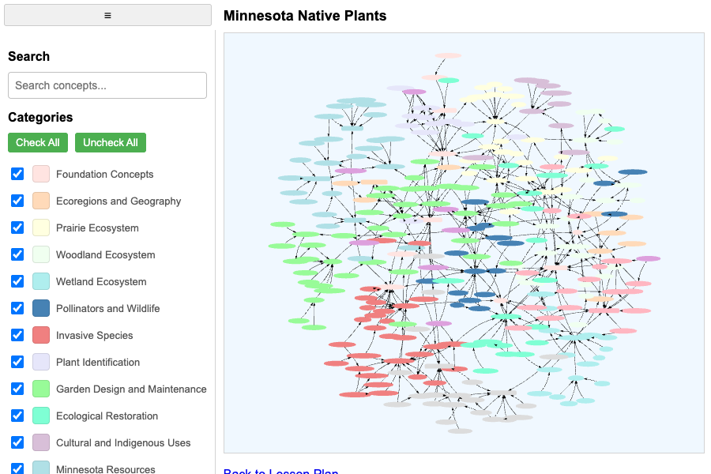
<div class="sim-card-body"><strong>Learning Graph Viewer</strong>
All 289 concepts in this book and the 446 dependencies between them, colored by category and searchable.
<span class="sim-card-chapter">Whole book</span></div>
</a>

</div>

## Using These in a Classroom

Every sim runs entirely in the browser with no login, no data collection and no
server. To embed one in your own course page, copy the iframe line from that
sim's page — for example:

```html
<iframe src="https://arunbatchu.github.io/minnesota-native-plants/sims/prairie-root-depth/main.html"
        height="600px" scrolling="no"></iframe>
```

They are licensed CC BY-NC-SA 4.0 along with the rest of the book, so you are
free to use and adapt them for non-commercial teaching with attribution.
